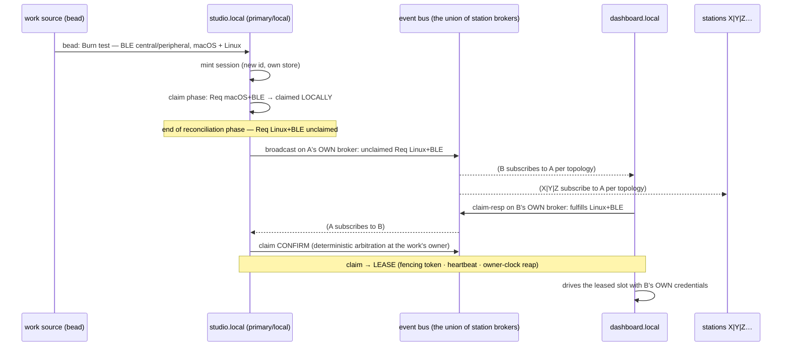

# SCRATCH — the grid alignment: the office grid, the honesty pass, and the bus

**Status: alignment surface (2026-07-03), drafted from the live realignment session.** Nico stopped
the multi-root/federation pass mid-read ("the first true run has shown that we're missing the
target") and the session realigned the architecture against what he is actually building. Most
decisions below were **ruled in-session** (marked RULED, with his words); a small set remain
PROPOSED for his ratification. Supersedes the remote half of `SCRATCH-multi-root-federation.md`
(now pointed here); its local half resumes under this frame.

## 1. The target: the office grid

Stations on ~every machine in the office — three Macs, two Linux — **not configured identically**.
The worked example: the work station runs internal packages/tools but coordinates with the
personal station, which HOSTS the memento substations the job is starting to build on. Inference
providers split cleanly between personal and work accounts: **"no credentials leaked, just work
assigned."** Stations can host clones of the same substation without being identical.

### The model (RULED)

- **D-A1 — Stations host substations.** Hosting = the store + repo clone + roots live there =
  the right to DRIVE that work locally, with station-local credentials/providers/harnesses.
  Configuration is station-local and never travels.
- **D-A2 — Assignment-federation, never observation-federation.** A remote substation is NEVER a
  snapshot member of my station; it is a peer's hosted substation, and work reaches it by
  assignment over the bus. (Kills the paused SCRATCH's D-Z7 "remote member = another
  SnapshotSource" — that shape would have burned the wrong credentials on the wrong work.)
- **D-A3 — The claim flow (the whiteboard, 2026-07-03).** When a station mints new work it tries
  to **claim it first, locally**. Whatever is still unclaimed **at the end of a reconciliation
  phase is broadcast** to the network for pickup by any station that fulfills the requirements.
  Claims are **per-requirement (capability slots), not per-bead** — one bead can fan out (the Burn:
  `Req macOS+BLE` claimed locally, `Req Linux+BLE` broadcast, claimed by `dashboard.local`).
  "The requirements" are grid-runner configuration, most likely asset-based — OS, system reqs,
  available agent slots, has-dart — i.e. exactly `CapabilityFacts` containment matching (already
  shipped in M6, with `ToolchainProbe`); a public/private key exchange where the public key rides
  the durable bead is an admissible `Trust` variant.
- **D-A4 — Claim → lease is two-phase.** The claim bus does *assignment*; the already-built lease
  machinery does *execution* (owner-authoritative `LeaseManager`: monotonic fencing token,
  heartbeat, owner-clock reaping). "Federation + Leasing."
- **D-A5 — The bus carries coordination; dolt stays truth; git carries the code.** (Reaffirms the
  grid_federation/ADR-0011-D7 posture already in the library doc.)

### The canonical sequence (transcribed from the whiteboard)

"More machines can exist than just point-to-point" (the X|Y|Z lifeline); the bus is drawn as its
own actor because under D-B1 it IS one — the union of everyone's brokers, not a place.

## 2. The honesty pass (packages)

| today | becomes | status |
|---|---|---|
| `grid_controller` | **`beads_dart`** (published) + grid opinions migrate to `grid_engine` | extraction RULED; *publication* PROPOSED (OQ-A1) |
| `grid_reconciler` | **retired with RS-8** | **RULED (approved)** |
| `grid_federation` | contracts → engine/SDK; impls → `federated_grid_assets` (power_station) | **RULED (approved)** |
| `grid_engine` | + federation concepts; keeps its StateNotifier layer | RULED |
| `grid_runtime` | loses the legacy `dispatch_interactor` path (dies with RS-8) | follows D-A7 |
| `zero_conf_grid_assets` | NEW (power_station): discovery + **topology opinions** | RULED (placement) |

- **D-A6 — `beads_dart`: the beads layer becomes an ecosystem package.** `grid_controller` is the
  M1 kernel wearing a legacy name — what it actually contains is a beads client: `Bead`/
  `GraphSnapshot` models, envelope codec, `bd` CLI wrapper, workspace discovery (server/embedded),
  the Dolt SQL read path + `@@<db>_working` probe, watchers, diff. That publishes as `beads_dart`
  (pub.dev name verified free 2026-07-03; `bd_dart`/`dolt`/`dolt_dart` also free), matching the
  `butane_dart` naming pattern. Grid opinions (ownership predicates, driveability narrowing,
  session-bead semantics) move to `grid_engine`, not to pub. Obligation: a documented
  version-compat contract against bd releases (the schema-drift guard, pinned-version tested).
- **D-A7 — `beads_dart` is Stream/Future ONLY (RULED: "Nope, just beads_dart").** No riverpod, no
  StateNotifier, no framework deps — "Futures for acts, Streams for observations" enshrined at the
  package boundary (+ synchronous `current` where a seed value is needed). Implementers build
  notifiers/providers on top; `grid_engine` keeps its thin StateNotifier layer as the genesis_tree
  consumption adapter (ADR-0007 §6.6 doctrine intact). This extraction EXECUTES the outstanding
  ADR-0007 Riverpod purge (riverpod ^3.0.0 + 4 live files in grid_controller today).
- **D-A8 — `grid_reconciler` retires with RS-8 (RULED, approved).** Inventory (2026-07-03): only
  two import sites remain, both condemned legacy — `grid_cli/run_command.dart` (the transitional
  `run` verb, retired at RS-8) and `grid_runtime/dispatch_interactor.dart` (the M3 pre-tree
  dispatch path, unused by the tree engine). Nothing shifts to the engine by default — the engine
  already grew its own restart/supervision. Salvage checklist before deletion: the pinned gc
  byte-port fixtures STAY (provenance); one pass over `gates/`/`recovery/` for anything the engine
  genuinely lacks; its `providers/` (more Riverpod) dies for free.
- **D-A9 — `grid_federation` dissolves along the ADR-0008 meta-pattern (RULED, approved).**
  Concepts → engine/SDK: the `StationClient` bus seam, `Presence`/`CapabilityFacts` value types,
  claim/lease protocol contracts ("the engine knows federation in concept, not detail"). Impls →
  power_station **`federated_grid_assets`**: HTTP server/client, the MQTT bindings, `LeaseManager`
  as owner-authoritative arbitration policy. `zero_conf_grid_assets` stays its own pack.

## 3. The bus

- **D-B1 — Decentralized MQTT as the primitive shape (RULED as the model).** Every station
  **publishes only on its own broker** and subscribes to others per topology. Federation
  primitives are PRIMITIVES — topology is the implementer's choice, and the topology opinion ships
  in `zero_conf_grid_assets`:
  - **mesh** — everyone subscribes to everyone (O(N²) connections; the office runs this, N=5);
  - **GridHub** — spokes subscribe only to a hub; the hub is *just a station running nothing but
    federation assets*, doling claimable work off its own broker (the ADR-0008 "optional
    downstream product" slot). Same binary, same primitive, topology by configuration.
  The publish-own rule maps claim-in-own-store onto the wire: presence = your broker's liveness
  (+ LWT), advertisement = retained messages on your own broker, claims = notifications on your
  own broker, arbitration = deterministic at the work's owner.
- **D-B2 — Broker IN-PROCESS, single-writer (RULED 2026-07-03).** Nico: in-process; pub.dev has
  "not a lot of good/maintained options" — so `federated_grid_assets` defines its **own abstract
  broker interface** to shield the dependency: try existing packages behind the seam first, write
  our own single-writer subset only if they fail, swap freely later. Original rationale stands: The publish-own
  rule makes each broker single-writer, collapsing it to a retained-topic map + subscriber fan-out
  + LWT — no fan-in races, no cross-publisher arbitration. Lifecycle unity becomes correctness:
  your broker IS your presence (station-dark = broker-dark; a subscriber's connection drop is the
  honest disconnect signal — no zombie retained ads from an out-of-process broker outliving its
  station). No external daemon on five machines; config stays where assets shape it; keeps the
  one-language bet. Precondition: vet the existing pub.dev brokers (`mqtt_server`, `mqtt_broker`,
  `dart_mqtt_broker` exist; maturity unvetted) before building a bounded single-writer subset
  (CONNECT/SUB/PUB, QoS 0–1, retained, will, ping). Because MQTT is wire-standard, mosquitto stays
  the escape hatch behind the same seam.
- **D-B3 — Bus schema: ACP-shaped, MQTT-carried (DIRECTION RULED: "transport is wrong but maybe
  the messaging schema").** ACP = Zed's Agent Client Protocol (agentclientprotocol.com) — the same
  dialect the harness seam already speaks; NOT IBM's retired ACP; MCP is NOT being introduced now
  (RULED). Borrow the JSON-RPC 2.0 envelope + method namespacing + initialize-time capability
  negotiation; carry it as MQTT messages: broadcast-unclaimed = a *notification* on your own
  broker; claim-resp/confirm = request/response pairs correlated by id across two brokers. The
  concrete method surface extends `protocol.dart` (claims + presence + advertisement, versioned).
- **D-B4 — A2A parked until model/agent routing (RULED).** Its agent-card shape overlaps our
  `Presence`/`CapabilityFacts` advertisement and "becomes more relevant when we start doing
  model/agent routing" — revisit there, not for the bus.
- **D-B5 — NO MQTT IN THE ENGINE, EVER (explicit, per Nico's TBC 2026-07-03).** ALL bus machinery
  — the in-process broker + its shielding interface (D-B2), MQTT bindings, topic layout, the
  ACP-shaped wire protocol impl, topology — lives in power_station's `federated_grid_assets`
  (+ `zero_conf_grid_assets` for discovery/topology opinions). The engine-level architectural
  surface for federation is **transport-free contracts only**:
  1. **the unclaimed-frontier hook** — the engine exposes "the unclaimed requirement set at the
     end of a reconciliation phase" for an asset claim capability to consume (the D-A3 broadcast
     trigger is engine-observable, asset-actioned);
  2. **requirement-slot resolution at the `EffectResolver` seam** — a step requirement the local
     station cannot fulfill resolves to an asset-provided claim+lease capability instead of a
     local spawn (local-vs-remote is a resolver decision, the remote impl is the asset's);
  3. **the SDK value types + seams** already ruled by D-A9 — `Presence`/`CapabilityFacts`,
     claim/lease protocol contracts, the transport-agnostic bus seam;
  4. **durable claim recording** rides the existing bd write chokepoint (claim-in-own-store).
  Nothing else touches the engine.
- **D-B6 — power_station gets its OWN ADR repository (RULED 2026-07-03).** It stops riding
  the_grid's ADR line (it already carries its own ADR-0000). Asset-level federation/bus/zero-conf
  ADRs land in power_station's `docs/adr/`; the_grid's line stays engine-scoped. This resolves
  OQ-A4's vessel: the engine contracts (D-B5) graduate into **the_grid ADR-0011** once the claim
  flow is proven end-to-end (spike-before-doctrine); the asset opinions graduate into
  power_station's own ADR line.

## 4. What survives from the paused SCRATCH

`SCRATCH-multi-root-federation.md` §3 (multi-root, D-M1..M7) and the LOCAL half of §4
(D-F1..F7 — the personal station hosting tg + dash + butane_flutter stores) **resume under this
frame** — tg-7gm and tg-nsj as filed, with tg-nsj re-scoped to local stores only. The durable
§4b pieces (absence ≠ deletion, staleness fail-closed for new work, discovered ≠ blessed trust
gate, membership-as-observed-state) survive; **D-Z7 is dead** (D-A2). Its OQ-1..6 still want
rulings when that pass resumes.

## 5. The ladder (PROPOSED sequencing)

1. **AL-1 — `beads_dart`** extraction + Riverpod purge (offline, the honesty pass; publication
   gate = OQ-A1).
2. **AL-2 — tg-7gm** multi-root (unlocks all-of-memento under one station).
3. **AL-3 — tg-nsj** local multi-store (dash + butane_flutter, post-grooming).
4. **AL-4 — RS-8** retire `run` + `dispatch_interactor` + `grid_reconciler` (D-A8 salvage pass).
5. **AL-5 — federation split** (D-A9 moves; no behavior change).
6. **AL-6 — the bus**: broker vet → in-process broker + the ACP-shaped claim protocol in
   `federated_grid_assets` (D-B2/D-B3).
7. **AL-7 — `zero_conf_grid_assets`**: mDNS discovery + mesh/GridHub topology opinions.

1–4 are independent of 5–7; the office grid needs 5–7 before the first cross-station claim.

## 6. Open questions — ALL ANSWERED (2026-07-03)

- **OQ-A1 — ANSWERED:** `beads_dart` extraction proceeds now; **publication rides the the_grid
  publish wave** ("we will publish when we publish the rest of the_grid").
- **OQ-A2 — ANSWERED:** in-process, behind our own abstract broker interface (→ D-B2).
- **OQ-A3 — ANSWERED:** blessed — and the sequencing is DELEGATED: *"You're in charge of the DAG
  as far as delivery. I just tell you what I wanted delivered and how, and right now this is one
  unit of work that I want delivered with these technical requirements."* Delivery decomposition
  below is the operator's, held to this surface's requirements.
- **OQ-A4 — ANSWERED via D-B5/D-B6:** engine contracts → the_grid ADR-0011 after the claim flow
  proves end-to-end; asset opinions → power_station's own new ADR line; no MQTT in the engine.

### §4-amendment discovered while taking DAG ownership: D-M1 needs a per-bead root override

The paused SCRATCH's D-M1 ("root granularity = per-substation, never per-bead") is WRONG for the
tg substation: **substation↔repo is 1:N there** — one store spans the_grid, power_station,
space_station, genesis. Per-substation roots are the correct DEFAULT, but tg-7gm (AL-2) must also
deliver a **per-bead root selector**: roots register by name (`--root <name>=<path>[@head]`, the
substation's own name = its default root), and a bead may select a registered root via its
envelope (e.g. `grid.root: power_station`); an unregistered selection is an arming-class LOUD
skip, never a gate. Without this, AL-5b/6/7 (power_station-repo beads in the tg store) stay
undrivable by the resident station.

## 7. Rulings log

- 2026-07-03 — StateNotifier drop scoped to `beads_dart` only ("Nope, just `beads_dart`").
- 2026-07-03 — `grid_reconciler` retire + `grid_federation` split: "clean recommendations,
  approved. Let's move forward with alignment."
- 2026-07-03 — Topology is implementer's choice; the opinion belongs to `zero_conf_grid_assets`;
  decentralized MQTT (publish-own/subscribe-others) + GridHub named as topologies.
- 2026-07-03 — ACP = agentclientprotocol.com; transport wrong, schema candidate; no MCP now; A2A
  cards → model/agent routing.
- 2026-07-03 — Whiteboard clarified: X = "Station X|Y|Z" (more machines than point-to-point);
  triangle actor = the event bus.
- 2026-07-03 — OQ-A1..4 answered (see §6): publish-with-the_grid; broker in-process behind our
  own interface; ladder blessed + **delivery DAG delegated to the operator** ("one unit of work…
  with these technical requirements"); no MQTT in the engine (D-B5), power_station gets its own
  ADR repository (D-B6), ADR-0011 graduates post-proof.
