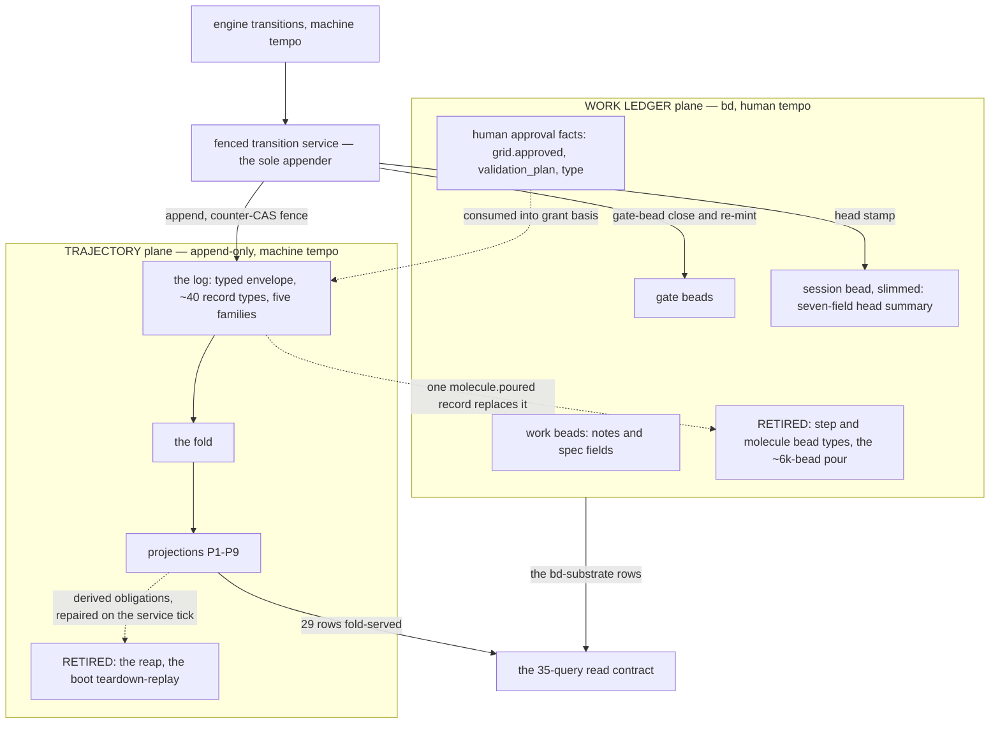

# Spike report — trajectory schema, fold, migration, storage (tg-hnlt)

**Status:** complete, 2026-08-31. Companion to the ratified decision
`docs/decisions/2026-08-30-trajectory-ledger-split.md` (tg-5l4p, option B) and the
admission-authority boundary (tg-y4fd). All five deliverables are design artifacts;
tg-zfek implements against them.

*The two planes and the one bridge between them. Abridged: of the 35 contract rows, 29 are fold-served, 5 stay on their contracted substrate (bd / lock file / live streams — only the bd ones are drawn) and 1 retires; record types and projections are named in full in `trajectory-schema.md`.*

## The five deliverables

1. **The trajectory record schema** — `trajectory-schema.md` (§1–§5): one append-only
   log table with a typed envelope (promoted, CHECK-guarded correlation keys; codec-governed
   JSON payload), ~40 record types across the decision's five families, a full per-type
   idempotency-key grammar, and the attempt-identity ladder (`mount_attempt_id` →
   `session_id` → `round` → `step_path` → `step_round` → `attempt_id` = one process
   incarnation; the two round ladders are separate keys). The fence is the empirically
   validated counter-CAS (probe T6i): one cell per station that both the appender and the
   epoch-advancer write, stale appends refused at COMMIT (error 1213); `uq_epoch_seq` and a
   non-decreasing-epoch alarm are the belt, with a named corruption-halt class.
2. **The fold** — schema §6: projections P1–P9, mapped row-by-row against the phase-1
   inventory's 35-query contract (`transition-inventory.md`). 29 rows fold-served, 5 on
   their contracted substrate (bd / lock file / live streams), 1 retired with a decision.
   Every restart-lossy in-memory latch is owned durably. Terminals are one record with no
   tail; the former teardown tail becomes derived obligations repaired idempotently by a
   defined service tick — the reap and the boot teardown-replay retire (falsifier clause 2).
3. **Session-bead slimming** — schema §7: the session bead survives as a seven-field head
   summary written only by the fenced service; hand-edits are detected and repaired, not
   load-bearing (the `tranquility-8krit` 149k-commit class dissolves).
4. **Migration** — schema §9: record-type groups G1–G4 cut whole behind quiesced epoch
   boundaries (zero open sessions on the outgoing discipline, boot-enforced, with a
   pre-stated drain fallback); legacy reads are a counted code-level dual-read (fallback
   count → zero is the cut criterion); the shadow comparator is a deliverable
   (`traj shadow-diff`) with a stated cut bar and an explicit unshadowable-facts list.
   Stage 1 is tg-zfek's ratification gate: terminal tail + step churn together.
5. **The storage call** — `storage-call.md`: the decision's same-database default is
   **overturned** — a separate `trajectory` database on the same bd-owned dolt sql-server.
   Grounds: ~14.6 KB of gc-unreclaimable history per dolt commit (measured) ≈ 15 GB/year
   inside bd's clone/backup domain at the cadence floor; commit-log attribution pollution
   in both directions; mandatory gc against the shared store being a documented operational
   hazard. Flip conditions both ways are stated. **Ratified by the operator 2026-08-31.**

## Method and verification trail

Multi-agent, staged, with the evidence retained:

- **Phase 1 — transition inventory** (7 parallel surface readers + synthesis):
  `transition-inventory.md` — every machine-tempo transition the engine emits today with
  its emitter (file:line), the 35-row fold query contract, the retirement list for
  tg-zfek, 11 correlation-key gaps, 19 open questions (all answered in schema §11).
- **Phase 2 — design panel**: three independent schema designs (relational-first,
  event-log-first, invariants-first) scored by three judges (contract completeness /
  soundness / migration-ops). Relational won two lenses and supplied the structure; the
  single-table log and the soundness machinery were grafted per the judges.
- **Phase 3 — verification**: an 18/18 fact-check of the draft's code claims against
  source; a red-team that produced 26 verified defects (5 fatal) and a 15-item holds list;
  and an **empirical dolt 2.2.2 probe** (`dolt-probe.json`) that ran the stage-0
  measurements early — DDL/CHECK/ignore/staging fidelity all pass; a read-only fence and
  `SELECT ... FOR UPDATE` are measured DEAD; the counter-CAS fence is measured ENFORCEABLE;
  ~42 fenced appends/s with one synchronous projection; per-row dolt commits cost 48×
  permanent storage.
- **Phases 4–5 — revision, audit, certification**: schema v2 fixed all 26 defects; a
  defect-by-defect audit (needs-another-pass: 12 revision-introduced defects) drove a
  scoped patch pass; re-certification returned minor-followups; the final ten
  sentence-level items were applied and logged (schema §14, certification round).

## What tg-zfek does first

Stage 0 of schema §9: the sibling database + DDL + codec + fenced service with the T6i
fence and full error contract, the `traj show` / `traj shadow-diff` verbs, the seven
pinned CI guard tests, and the seven remaining stage-0 measurements listed in
`storage-call.md` (bd sibling-db tolerance and online-gc semantics chief among them).
Then Stage 1 — the terminal tail and the step-churn path together, behind a quiesced
boundary — which is the decision's ratification gate.

Working artifacts not landed here (panel designs, judgments, audit reports) are retained
in the operator's station records and cited in schema §14.
