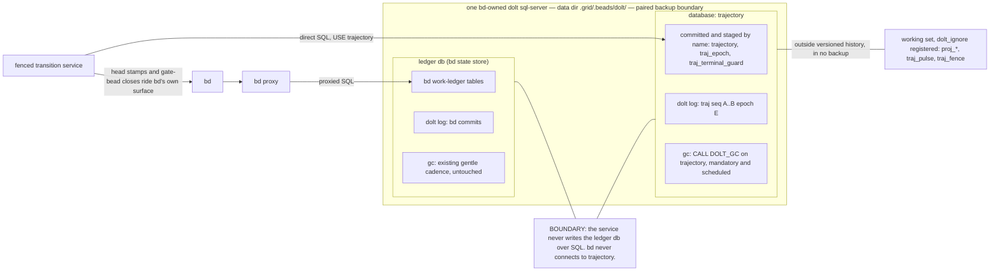

# The storage call — spike tg-hnlt, deliverable 5

**Status:** RATIFIED by the operator 2026-08-31 — supersedes the decision's same-database default (the decision doc's storage clause carries the amendment).
**Inputs:** decision 2026-08-30-trajectory-ledger-split (storage default clause), 02-schema-draft.md §10/§12, the dolt 2.2.2 empirical probe (T1–T8, this machine, 2026-08-30), the standing operational record (per-repo proxied bd servers, the 18 GB / 544,956-commit precedent, the dolt-server-kill/proxy-cleanup hazard).

---

## The call

**Separate database on the same dolt sql-server.** The decision's default — grid-owned trajectory tables inside the **ledger database** (bd's state store — the human-tempo work ledger; `tranquility` on the reference deployment, a private station's month-old state store, from which every measurement below is taken) — is **overturned** by the probe's storage arithmetic, not by any failure of the mechanisms designed for coexistence. Concretely: a `trajectory` database created as a sibling of the ledger database under the same server data dir (`.grid/.beads/dolt/trajectory/`, beside `.grid/.beads/dolt/<state-db>/`), served by the one bd-owned sql-server process, holding all `traj_*` tables, the `trajectory` log, and the dolt_ignore'd `proj_*` / `traj_pulse` working-set tables. The fenced transition service connects to the same server bd proxies through, `USE trajectory`, and never touches the ledger database over SQL. A fully separate store (own server process) is rejected. The schema draft's §4 DDL, §5 append discipline, dolt-commit policy, and the T6i counter-CAS fence carry over **verbatim** — nothing in the draft's design depended on cohabiting bd's database, and the probe ran every test on exactly the engine this database will run on.

*The ratified topology. Table lists are abridged — the ledger database's tables are bd's; the committed and `dolt_ignore`'d trajectory sets are enumerated in schema §4's DDL.*

## Justification

**The same-db option did not fail on its own terms — the probe largely vindicated it.** Honesty first, because the flip must be argued against the option's best measured self, not a strawman. T4 is the strongest same-db result in the probe: selective staging (`DOLT_ADD('trajectory')` + commit) committed only the trajectory tables while a deliberately dirtied stand-in bd table stayed unstaged through ~8,000 further appends and multiple commits. The service can hold its own commit cadence on a shared database indefinitely, at ~4% overhead (T7 B), without ever capturing bd's in-flight writes and without bd's dirtiness blocking a trajectory commit. §10.2's cadence axis (b), as the service's own concern, is measured to be a non-issue. T1 proved the DDL lands verbatim; T2 proved the CHECKs refuse at write time; T3 proved dolt_ignore keeps projections out of versioned history through commits, resets, and `checkout .`. If the call rested on write mechanics, same-db would stand.

**It is overturned by growth arithmetic: the log's permanent history lands inside bd's clone/pull/backup domain at ~15 GB/year at the cadence floor.** T7b measured ~14.6 KB of *unreclaimable* history per dolt commit — reachable commit history, which `dolt gc` cannot touch (confirmed: 48× storage for identical data at per-row cadence, gc reclaiming none of it). The draft's own commit policy floors the station at ~2,880 commits/day, with boundary events (epoch advances, terminals, round retirements — frequent under an 8-attempt storm) pushing above it. 2,880/day × 14.6 KB ≈ 42 MB/day ≈ 15 GB/year of permanent, monotonic history — the 18 GB pathology reincarnated, this time *inside the work ledger's own database*, where every future clone, pull, remote sync, and restore of the human-tempo ledger drags the machine-tempo log behind it forever. §10.4 already conceded the log never shrinks and named epoch-ranged archive tables "in a sibling database" as the likely relief valve — i.e. the design converges on a second database eventually regardless. Starting there costs nothing and avoids a migration whose trigger date is arithmetic, not hypothesis.

**The attribution cost is unfixable from the grid's side of the boundary.** §10.2(a)'s cost — trajectory rows swept into commits under `bd: update` messages — depends entirely on whether bd ever issues `-a`/`-Am`-shaped commits on the shared database. That is bd-internal behavior, version-dependent, outside grid control, and exactly the kind of another-tool's-internals dependency the operational record warns against. T4's re-scoped flip condition ("bd uses `-a` on the shared db") is checkable once, but it must stay true across every future bd release. The inverse cost is also real: at a 2,880/day floor the shared database's `dolt log` becomes >99% trajectory commits, drowning the operator's standing forensic practice of attributing bd store growth commit-by-commit (that practice found the 81%-retry-churn diagnosis this whole decision rests on). A separate database dissolves both directions structurally: `trajectory`'s log is 100% `traj: seq A..B epoch E` intent trail, the ledger database's log stays bd's, and no future bd behavior change can pollute either.

**T8's journal finding turns gc from hygiene into a mandatory operation — and mandatory gc against the shared store is the one operation the standing hazard record is about.** The probe found the uncommitted transaction journal grows ~22–24 KB per append regardless of payload size — ~48 MB per 2,000 appends, on the order of 1 MB/s at measured storm tempo (42 appends/s). ~99% is gc-reclaimable, so periodic gc is not optional; §10.1's "first `dolt gc` taking the service down" stage-0 case is more load-bearing than the draft treated it. Under same-db, that mandatory recurring operation runs against the database bd's proxy, pid/lock files, and every human-tempo workflow depend on — the exact store-goes-dark/zombie hazard already on the operator's record. Under separate-db, gc's data-plane blast radius is confined to trajectory's own files; the ledger database's journal gains zero bytes from trajectory workload and keeps its existing, gentle gc cadence. (The *server-level* residue of online gc — connection kills — is real and is stage-0 item 2 below.)

**The one-backup-domain benefit is thinner than the decision clause assumed.** The domain boundary that matters operationally is the server data dir, not the database: both databases live under `.grid/.beads/dolt/`, and one filesystem-level snapshot procedure (server quiesced) or one two-line `dolt backup` pair covers both. The single-domain purity was already punched through by design — `proj_*` and `traj_pulse` are dolt_ignore'd out of any backup in *either* shape (§10.3), so restore already means "restore + mandatory fold rebuild + liveness reads unknown." And the sync half of the benefit is prospective: the ledger database is a per-machine state store with no remote today; when sync materializes, a second remote is one configuration line. Prospective convenience does not outweigh measured, monotonic, unreclaimable cost.

**Why not a fully separate store (own server process).** A second long-lived server means a second port, second config, second lock/proxy lifecycle discipline on a machine already running four-plus per-repo dolt servers with a documented kill/cleanup hazard — pure operational surface with no isolation gain that matters: dolt databases on one server are already independent commit graphs, gc targets, attribution domains, and remote endpoints. Same-server also keeps one lifecycle to quiesce, preserves the option of cross-database *reads* on one connection if a forensic query ever wants them, and keeps trajectory inside the same crash/restart fate-sharing as bd — which the service must survive anyway (reconnect-with-fence-recheck, §10.1) and which is the honest topology for "one grid per machine." The separate store remains the named escape hatch if stage 0 falsifies shared-server behavior (flip conditions below).

**What the flip does not change.** Everything the probe validated transfers: the DDL (T1), CHECK enforcement (T2), dolt_ignore semantics and the force-only trap (T3), AUTO_INCREMENT monotonicity across restart (T5), the T6i counter-CAS fence and its 1213/1105 error contract (T6c/f/i), append throughput and the 30 s/512-row commit policy (T7/T7b), and JSON behavior (T8). The fence's global serialization point lives in `traj_fence` inside the trajectory database — it never touches bd and adds no bd coupling. The §12 dissent's second-appender revisit condition is orthogonal to this call and stands unchanged.

## Flip conditions

**Back to the same database** — all three required, any one missing keeps this call:
1. Stage 0 finds bd's server/proxy stack cannot tolerate a sibling database under its data dir (proxy assumes exactly one database, `CREATE DATABASE` breaks bd enumeration, or a nil-store-class regression), **and**
2. bd's commit style is verified never `-a`/`-Am`-shaped on its server (checked against the running config and pinned by a test, re-checked per bd upgrade), **and**
3. a real (not prospective) requirement materializes for trajectory to ride the ledger database's exact remote/sync stream atomically.

**Forward to a separate store (own server):**
1. Online `CALL DOLT_GC()` against the trajectory database measurably disrupts bd's service on the shared server (connection kills the bd proxy does not recover from without manual cleanup), with no acceptable scheduling window; **or**
2. the tg-y4fd soak shows shared-server process contention (CPU/IO, not lock) degrading append latency below the ~22–28 appends/s the full synchronous projection set needs under an 8-attempt storm; **or**
3. federation requires trajectory served to remote readers under its own auth/remote lifecycle that bd's server ownership cannot host.

**Reopen the whole storage shape:** a second appender ever exists (§12, unchanged).

## What stage 0 must still measure (the probe could not)

The probe ran solo, offline-CLI-plus-private-server, on throwaway databases. These are the holes:

1. **bd's actual commit behavior on its own server** — `@@dolt_transaction_commit` in bd's config.yaml, whether bd's write path issues `-a`-shaped commits, and whether bd tolerates `CREATE DATABASE trajectory` appearing under its data dir (list/read/write regression sweep against a copy of a real store). This is the same-db flip's factual gate and the separate-db safety gate at once.
2. **Online gc semantics on a shared multi-db server** — does `CALL DOLT_GC()` on `trajectory` terminate connections serving the ledger database; does bd's proxy auto-recover or does it need the standing pid/lock cleanup; is there a gc mode/window that leaves bd undisturbed. The probe only ran CLI gc against stopped databases. This measurement sets the gc schedule (steady cadence vs. quiesced windows) and is separate-store flip condition 1.
3. **Append latency under concurrent bd load with the FULL synchronous projection set** — T7's 42 appends/s carried one projection upsert; §6 requires P1–P6+P8 in-transaction, plausibly 35–45 ms/append. Measure on a shared server with live bd traffic, at 8-attempt storm shape, against the §5 pre-authorized-retreat threshold.
4. **Fence behavior across server bounce mid-transaction** — the reconnect-with-fence-recheck path (§10.1): kill the server between an appender's UPDATE and COMMIT; verify the service fails the fence guard loudly rather than hanging or double-appending, and that a refused live boot's behavior matches the dry-arm lock semantics on record.
5. **Rebuild duration at realistic log size** — golden replay from seq 0 at ≥100 k rows (probe: 2 k), against the stated recovery budget; the epoch-boundary snapshot contingency triggers on this number.
6. **The two-database restore drill end-to-end** — restore both databases from a paired snapshot, run mandatory `traj replay`, verify liveness renders `unknown`, and exercise the head re-stamp repair for `grid.head.last_seq` pointers that outrun a restored trajectory (the only cross-database consistency seam this shape has; there is no transactional coupling to break).
7. **The guard tests the probe designed but stage 0 must pin in CI** — `dolt status` clean after every fold write (the T3 force-trap tripwire); `@@dolt_force_transaction_commit` never set on any service connection (T6f); dolt-commit counting via `COUNT(*) FROM dolt_log`, never trusting `DOLT_COMMIT`'s return under `--skip-empty` (the T7 measurement trap); `--doltcfg-dir` handling for any CLI op inside the data dir (the T1 trap); service pinned to `main` with fail-closed branch-change detection (the T3 branch-vanish finding).

## The operational contract this choice imposes

**Server lifecycle.** One server, bd-owned, config unchanged; `trajectory` is created once via SQL on that server and lives beside the ledger database under `.beads/dolt/`. **Stop order:** quiesce the transition service first (it goes inert; §5 fenced-out behavior), then bd proxy cleanup per the standing playbook, then the server. **Start order:** server, bd, service — the service's first act on any (re)connect is the fence recheck, and a refused append during a bounce is a loud fence failure, never a hang. `reload` never applies to the service (snapshot-resident rule); bounce to pick up code.

**gc.** Mandatory and scheduled, not hygienic: budget ~22–24 KB of journal per append (~1 MB/s at storm tempo). `CALL DOLT_GC()` targets the `trajectory` database on a cadence set by stage-0 measurement 2 — steady interval if online gc proves non-disruptive, service-quiesced windows if not. The ledger database's gc cadence is untouched and independent; trajectory workload adds zero journal to bd's files. Any CLI gc runs inside `dolt/trajectory/` with `--doltcfg-dir` discipline.

**Backup.** One snapshot procedure over `.beads/dolt/` (quiesced), or two `dolt backup` remotes — both databases, always as a pair, timestamped together. Restore = both databases to the paired time, then mandatory fold rebuild, liveness `unknown` until next beat, head re-stamp repair pass. `proj_*` and `traj_pulse` are in no backup by design; only `traj_pulse` is unrebuildable and its consumers render that.

**Commit policy.** The service commits its own database on the §5 cadence (30 s / 512 rows / boundary events), staging `trajectory`, `traj_epoch`, `traj_terminal_guard` by name, **plus a hard minimum interval between dolt commits regardless of boundary events** (T7b amendment — commit count, not row count, is the storage lever). Growth relief remains epoch-ranged archive tables, now naturally a third sibling database on the same server when triggered.

**bd coexistence.** bd never connects to `trajectory`; the service never writes the ledger database over SQL — every bd-side effect (head stamps, gate-bead closes) rides bd's own surface as a §5 derived-obligation repair. `dolt add --force` is banned in all grid tooling (the trap needs deliberate force even in this shape, and if ever sprung it dirties only the trajectory database — bd's commits are structurally unreachable). One grid per machine stands; the service holds persistent connections with the T6f session-variable ban and both error handlers (1213 = fence/epoch race, retryable-or-refuse; 1105 = uq_epoch_seq violation, detect-and-halt) wired distinctly.

**Amendments this call feeds back to the draft:** §10.2 rewrites from "flip conditions under weigh" to this call's outcome; §10.4's relief valve becomes "third database, same server"; §5's fence section adopts T6i as primary with uq_epoch_seq as belt and drops "no design's fence is provably enforceable on dolt" from §1; §12's FOR UPDATE dissent entry closes as NOT AVAILABLE (silently parsed, enforces nothing — measured).
