# Trajectory record schema — V2 (spike tg-hnlt, final schema deliverable)

**Provenance.** V2 of the phase-2 draft (02-schema-draft.md), revised against the phase-3 red-team
(03b-redteam.json: 5 fatal, 17 major, 4 minor defects, all addressed in §14), the dolt 2.2.2
empirical probe (03a-dolt-probe.json, T1–T8), and the storage call (03-storage-call.md, which
overturns the same-db default). The draft's lineage stands: three designs scored by three judges,
relational's structure winning, one log table with a JSON payload plus promoted CHECK-guarded
envelope columns. Nothing the red-team's holds list certifies has been weakened; every change is
logged in §14 with the defect it answers.

Storage shape under design: **a separate `trajectory` database, sibling of the ledger database
(bd's state store — the human-tempo work ledger; `tranquility` on the measured deployment, a
private station's month-old state store), on the
same bd-owned dolt sql-server** (§10 — the storage call, imported). The draft's `⚠same-db` flags
are resolved, not carried.

---

# 1 Envelope

Every record is **one row in `trajectory`**: identity, order, time, authority, provenance, the
promoted correlation keys the fold joins on constantly (correlation-key gaps 1, 4, 5, 8), a small
set of promoted invariant columns the database CHECK-enforces (probe T2: all five probe-era CHECKs
refuse at write time, by name; §4 now ships **seven** — `ck_grant_link` and `ck_seat` postdate the
probe, and stage 0 pins them), and a JSON payload for everything type-specific. Payload shape is governed by the
codec registry (§2.6).

*The core versioned tables plus the two working-set tables. `trajectory`'s envelope is shown
ABRIDGED — identity/order, the provenance trio, and the promoted correlation keys only; the full
column list is the table below and the DDL in §4. `traj_fence` and `traj_pulse` are `dolt_ignore`'d
working-set state, joined by convention (station, subject_id) rather than by a declared key.*

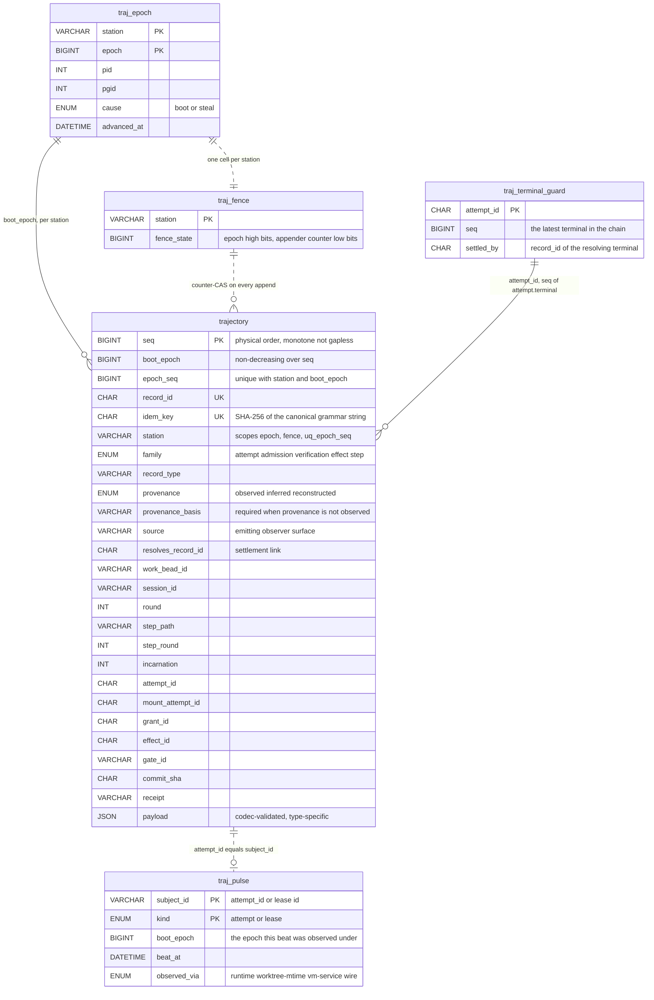

| Field | Type | Req | Notes |
|---|---|---|---|
| `seq` | BIGINT AUTO_INCREMENT PK | ✓ | **Physical order.** Sole appender ⇒ one monotonic sequence, assigned inside the append transaction. **Monotone, NOT gapless** (probe T5): a failed/rolled-back append burns a seq; dolt never reuses one across restart or delete-then-restart. Consumers must never read a gap as a missing record — only `(boot_epoch, epoch_seq)` is contiguous. |
| `boot_epoch` | BIGINT | ✓ | Authority epoch (§5). **Alarm predicate, stated:** `boot_epoch` is **non-decreasing over `seq`** — asserted against the previous row on every append and full-scanned at boot. This is the check that catches the two-different-epochs split-brain that `uq_epoch_seq` cannot (fatal 1). A violation is the **corruption-halt alarm class** (§5 error contract): the service halts, flares, and waits for the operator. |
| `epoch_seq` | BIGINT | ✓ | **Logical order** within the epoch, service-assigned at commit. `UNIQUE (station, boot_epoch, epoch_seq)`. The seq/epoch_seq agreement + the non-decreasing-epoch predicate are the **belt**; the **primary fence is the `traj_fence` counter-CAS (§5), measured enforceable on dolt (probe T6i)** — the draft's "no design's fence is provably enforceable on dolt" is retired as a finding, not a fear. |
| `record_id` | CHAR(26) UNIQUE | ✓ | ULID minted by the service. Stable external reference — fences, flares, and `resolves_record_id` cite this, never `seq`. |
| `idem_key` | CHAR(64) NOT NULL UNIQUE | ✓ | **SHA-256 (hex) over the canonical grammar string** (§5 — full table, one row per type, no exceptions). Fixed-width: the VARCHAR(160) overflow class (step keys ~298 chars) cannot exist. NOT NULL for every type — at-least-once producers only get exactly-once records if the key is mandatory. |
| `idem_key_text` | VARCHAR(512) | ✓ | The human-readable grammar string, **non-unique** — the operator greps this, the database enforces the hash. |
| `family` | ENUM('attempt','admission','verification','effect','step') | ✓ | Fold dispatch. |
| `record_type` | VARCHAR(48) | ✓ | e.g. `attempt.terminal`. Vocabulary seeded from flare names (Q6). |
| `type_version` | SMALLINT | ✓ | Per-type payload schema version; codec-governed (§2.6). |
| `occurred_at` | DATETIME(6) | ✓ | When the observed fact happened. Advisory testimony — never an ordering source, **except** for `reconstructed` rows, which the fold orders by `occurred_at`. |
| `recorded_at` | DATETIME(6) | ✓ | When appended. |
| `station` | VARCHAR(64) | ✓ | The composing station's name. **Scopes the epoch, the fence, and `uq_epoch_seq`** — a second station over the same database gets its own epoch line and fence cell instead of permanently starving the first (major: traj_epoch scope). **This scoping is DEFENSIVE, read-side only** (audit round 2): it makes a second station's writes loud — refused or detected — instead of silent; it is NOT license for a second live appender, which remains the condition that reopens the whole storage shape (§10 flip conditions, §12 — unchanged). Cross-station replay order is out of scope until that reopening. |
| `seat` | VARCHAR(64) | – | Substation/seat identity. **Derived at append time by the service from the work bead's store prefix** — no writer supplies it, so no writer can forget it; enforced by `ck_seat`: `work_bead_id IS NULL OR seat IS NOT NULL`. Part of the §2.6 envelope-construction rules. |
| `authority_id` | VARCHAR(64) | ✓ | tg-y4fd authority identity (`<station>/<epoch>`). |
| `fencing_token` | BIGINT | – | **Promoted and indexed** (was buried in grant/lease JSON — the single most load-bearing tg-y4fd value, checked on every grant-scoped append and every federation wire request; a JSON extract on the hottest path was indefensible). `(epoch << 32) \| per-epoch counter` — see §5 for why 32 low bits, not the draft's 20. |
| `provenance` | ENUM('observed','inferred','reconstructed') | ✓ | Q18 (§8). Default `observed`. |
| `provenance_basis` | VARCHAR(128) | – | Required (CHECK) when provenance ≠ observed. |
| `source` | VARCHAR(160) | ✓ | Emitting observer surface (`subprocess_provider`, `restart_reconciler`, `migration_import`). |
| `resolves_record_id` | CHAR(26) | – | Settlement link: a later record healing an earlier one (unknown outcomes, refusal restores, **unknown terminals** — the guard now permits the chain, §4). |
| `work_bead_id` | VARCHAR(40) | – | **Never mutated** — no `#rN`, no `#void-`. |
| `session_id` | VARCHAR(40) | – | bd session-bead id (head summary, §7). |
| `round` | INT | – | **Session rework round** — bumped only by `attempt.round.retired`. |
| `step_round` | INT | – | **Chain depth per path** — bumped by `step.superseded` AND by a gate-cleared rearm (§2 F5). **EVERY bump writes the predecessor row's `superseded_by_step_round`** on `proj_step_cursor`, with the cause on the new **trajectory record's payload** (P2 carries no cause column — no fold read consumes it; cert round) — the chain has no holes regardless of which writer bumped (audit round 2). Two ladders, two columns (held by the red-team; extended to P5's key in this revision — fatal 3). |
| `step_path` | VARCHAR(255) | – | Node path within the molecule. **Successors keep the path and bump `step_round`** — stated unambiguously (fatal 4). |
| `incarnation` | INT | – | Process respawn ordinal within (session, round, step_path, step_round). **A respawn ENDS the attempt** (§3). |
| `attempt_id` | CHAR(26) | – | One process incarnation (§3). |
| `mount_attempt_id` | CHAR(26) | – | Pre-session admission ladder key (§3). |
| `grant_id` | CHAR(26) | – | **The one and only grant join key** (CHECKed present on every `admission.grant.*` and `attempt.session.started`). The draft's payload-level `grant_record_id` is demoted to optional provenance via `resolves_record_id`-style reference; nothing joins on it (minor: grant duplication). |
| `effect_id` | CHAR(64) | – | **Keys the LOGICAL mutation, not the attempting process**: SHA-256 (hex) of the canonical effect string `<session>:<round>:<step_path>:<step_round>:<kind>:<target_digest>`, where `target_digest` = SHA-256[:16] of the canonical target (repo, branch, base, publish sha as applicable) — the same hash-the-grammar discipline `idem_key` adopted (audit round 2: the raw string can reach ~338 chars, overflowing the old VARCHAR(191); a fixed-width hash can neither fail strict-mode nor truncate-collide two logical effects). `proj_effects` carries the raw string as a non-unique `effect_id_text` for greppability. A respawned incarnation's retry lands on the SAME effect_id and dedupes correctly; the reconciler's GitHub probe has a 1:1 key. `attempt_id` remains on the envelope as attribution only (major: effect_id ordinal). |
| `gate_id` | VARCHAR(64) | – | Gate bead id. |
| `worktree` | VARCHAR(255) | – | Path. |
| `branch` | VARCHAR(160) | – | |
| `commit_sha` | CHAR(40) | – | The digest column; which digest (base/head/pushed/merge) is the record type's business. Indexed. |
| `receipt` | VARCHAR(255) | – | Namespaced external receipt: `pr:<repo>#<number>`, `obs:<observationId>`, lease id. Indexed. |
| `expires_at` | DATETIME(6) | – | Grant/lease expiry (promoted so ck_grant can enforce it). |
| `outcome` | ENUM('succeeded','failed','cancelled','lost','escalated','settled','unknown') | – | Promoted terminal outcome — the decision-faithful enum, verbatim (red-team hold: the only place the draft quotes the ratified decision rather than paraphrasing; unchanged). |
| `unknown_reason` | VARCHAR(32) | – | Required (CHECK) when `outcome='unknown'`. Open vocabulary owned by the codec: `write_timeout`, `cancel_raced_ack`, `inferred_exit`, `report_dropped`, `breadcrumb_dropped`, `claim_then_lost`, `epoch_lost`, `other`. |
| `payload` | JSON NOT NULL | ✓ | Type-specific fields, codec-validated (§2.6), size-bounded (§10 payload policy). |

**Ordering source.** `seq` physical, `(station, boot_epoch, epoch_seq)` logical, timestamps
testimony. Nullability of the correlation block is per-type, enforced at construction by the sealed
record classes plus the envelope CHECKs in §4.

---

# 2 Record types

Five families. Every catalog row dispositioned **T** or **B** is covered; merges and drops are
named. Changes from the draft are marked with the defect they answer.

*The `family` ENUM to the `record_type` vocabulary that exists in V2, families 1–2. Types retired,
merged, or dispositioned R/L are omitted — each family table's last row names them. Slash-joined
leaves are the sibling types the tables list together.*

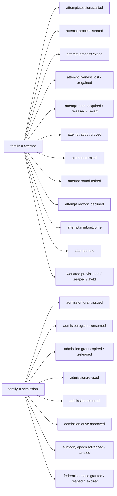

*The same map for families 3–5.*

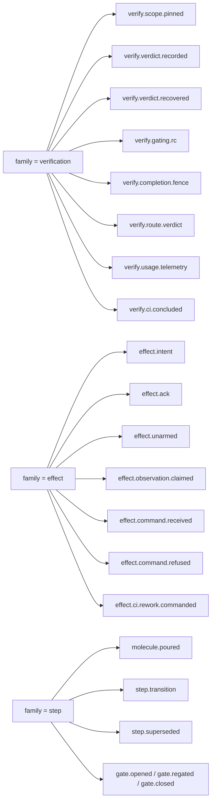

## Family 1 — attempt lifecycle

| record_type | Payload fields (✓=required at construction) | Covers / notes |
|---|---|---|
| `attempt.session.started` | rig✓, model✓ ('molecule'); env grant_id✓ | `attempt.started` (B: the service also creates the slim head, §7). The grant link is the envelope `grant_id`, nothing else (minor fix). |
| `attempt.process.started` | pid✓, pgid✓, predecessor_attempt_id; env attempt_id✓, incarnation✓, worktree, branch | Merges the dead `attempt.identity.stamped` path. `GRID_INSTANCE_TOKEN` retires in favor of `attempt_id` exported into the process env. |
| `attempt.process.exited` | pid✓, exit_code, exit_kind:enum(exited,died,**respawned**)✓, inferred:bool✓, reason | **A respawn ENDS the attempt** (minor fix): `exit_kind='respawned'` is that attempt's terminal shape; the successor attempt carries `incarnation+1` and its `attempt.process.started` payload names `predecessor_attempt_id`, so the chain is walkable in both directions. The draft's `respawn_epoch` is dropped in favor of the successor's incarnation. `inferred=true` ⇒ envelope `provenance='inferred'`. |
| `attempt.liveness.lost` / `.regained` | last_beat_at✓, threshold_ms✓ | Raw beats are **not records** — they ride `traj_pulse` (working-set, dolt_ignore'd); only threshold *transitions* append, **keyed on the observed crossing** (`liveness:<attempt_id>:<last_beat_at µs>:<lost\|regained>` — deterministic per observation, idempotent under retry of that observation; a five-flap attempt records five losses, major fix). **The detector honours `unknown`** (major fix): it may emit `lost` only for an attempt whose beat it has itself observed **within the current epoch** — an empty pulse table after any of the five `unknown` paths (restore, rebuild, epoch advance, branch switch, `--force` trap recovery — §10/§13) yields `unknown`, never `lost`, so a restore cannot mint terminals for live attempts. `traj_pulse` is truncated at epoch advance; rows prune on attempt terminal (§4). |
| `attempt.lease.acquired` / `.released` / `.swept` | token✓ (= attempt_id), disposition:enum(held,released,killed,refused_unsafe,left_adoptable), terminate_result, clear_failure | The in-place breadcrumb overwrite becomes append history. |
| `attempt.adopt.proved` | outcome:enum(adopted,respawned)✓, fence_pgid, fence_pid | Adopted-vs-respawned durable for the first time. |
| `attempt.terminal` | reason; envelope outcome✓, unknown_reason when unknown; `resolves_record_id` on a **settling** terminal | One terminal type (merge of `.succeeded/.escalated/.lost/.settled`). Voiding stops rewriting `work_bead`; `outcome='lost'` + intact keys replace `#void-`. One record, **no tail** — head stamp, gate sweep, worktree reap are derived obligations (§5). **An unknown terminal is settleable** (major fix): a later probe appends a second `attempt.terminal` with `resolves_record_id` → the unknown one; `traj_terminal_guard` permits the chain while still refusing two *independent* terminals (§4). |
| `attempt.round.retired` | old_round✓, new_round✓, cause:enum(rework,void)✓ | Bumps envelope `round` only. Merges `attempt.round.closed`. Operator note/spec-clear stays a bd write (B). |
| `attempt.rework_declined` | reason✓ | HELD served from P1. |
| `attempt.mint.outcome` | phase:enum(failed,exhausted,abandoned,refused)✓, mint_attempt✓, max_attempts, stage, reason | Merge of the four mint flares; durable for the first time; keyed by `work_bead_id` + `mount_attempt_id`. |
| `worktree.provisioned` / `.reaped` / `.held` | adopted_existing:bool✓, uncommitted, unpushed, stashes; env commit_sha=base_sha (✓ on provisioned via CHECK), branch✓, worktree✓ | Worktrees are attempt-scoped. Recording is **not** the fix for the stale-adopt scar class — the barrier is (major fix): admission **refuses `clause='worktree-outstanding'`** while P6 shows a live worktree under a terminal session for the bead (§5 obligations). The record makes the wound auditable; the barrier makes the repair's lateness harmless. |
| `attempt.note` | body✓, channel✓, note_ordinal✓ | Q5 destination-declared journaling. The ordinal is **service-minted** (major fix — free text has no natural key); notes are accepted as at-most-once. |
| *(retired)* | | `attempt.teardown.replayed` — **R** per the falsifier. `attempt.heartbeat` as a record — see `.liveness.*`. |

*One attempt, from session start to a terminal outcome. The `outcome` enum is shown in full,
verbatim; the record types driving each edge are the labels. Lease, adopt, mint, note, worktree,
round-retire and rework-decline records are attempt- or session-scoped but not lifecycle states —
they are omitted here, and listed in the table above.*

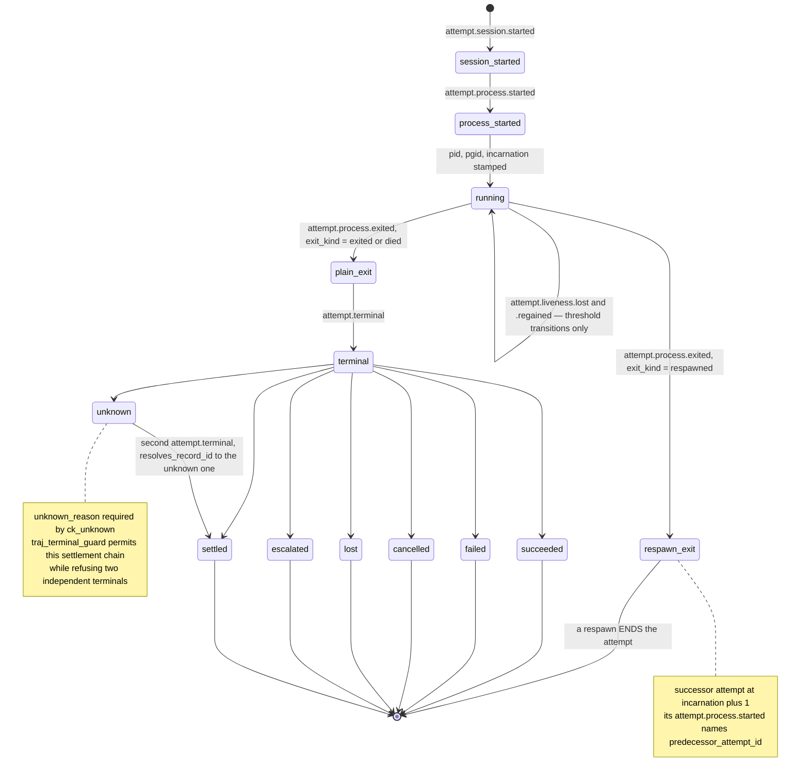

## Family 2 — admission grants and authority

| record_type | Payload fields | Covers / notes |
|---|---|---|
| `admission.grant.issued` | basis:JSON✓ = `{bead_rev, approved_label_rev, validation_plan_digest, issue_type, dep_revs, drive_list_member, snapshot_captured_at, cap_override?}`; env grant_id✓, fencing_token✓, mount_attempt_id✓, expires_at✓ | The tg-y4fd grant; closes gap 6 wholesale. `fencing_token` is now an indexed envelope column, not a JSON field (major fix). `basis` stays JSON deliberately: a snapshot document, not a join surface. |
| `admission.grant.consumed` | — ; env grant_id✓ | Grant → session link; subsumes `admission.attempt.recorded` — the mutable mount-attempt bead retires; counts become P3 folds. |
| `admission.grant.expired` / `.released` | cause:enum(expired,released,superseded); env grant_id✓ | Level-triggered lease lifecycle. |
| `admission.refused` | clause✓, snapshot_rev✓, detail (origin/floor for trust; dead_session+pgids for void-refused) | One refusal shape, **level-shaped key**: `refused:<bead>:<clause>:<snapshot_rev>` (major fix) — it re-fires exactly when the evaluated basis actually changed, so a bead refused → restored → refused-again on the same clause re-latches correctly (new snapshot_rev ⇒ new key), and an idle ineligible bead does not spam a row per build (same snapshot_rev ⇒ dedupe). P3's clause level derives from the latest refusal/restore pair per (bead, clause) ordered by seq. **First-refusal-wins is dropped for the record stream**: the evaluator appends a refusal per *failing clause* (cheap — the clause list is short), so admission's first-refusal presentation is a P3 read, not an information loss. |
| `admission.restored` | clause✓, actor (operator cap-release); `resolves_record_id` → the refusal it clears | **The writer now exists and is homed** (fatal 2): eligibility re-evaluation lives in the tg-y4fd **`StationAdmissionAuthority` itself**, riding the same fenced service tick as the derived obligations (§5 — owner, interval, fencing, clean-down fixpoint all defined there). Restores are **per-clause and independent of overall eligibility** (major fix): the evaluator appends `restored{clause}` for every previously-refused clause that no longer holds, whether or not the bead is now eligible — a two-clause bead clears its first clause the moment it clears, and row 2 reports the true remaining clause. **tg-y4fd tripwire, addressed explicitly:** the tripwire forbids reconstructing `WorkList`/`SessionScope` state outside the tree. The authority re-evaluating its **own mount gate** — the canonical *pure eligibility policy over bead state* that the ratified decision assigns the authority to evaluate against versioned snapshots — reconstructs no tree state, no session state, and no scheduler: it re-runs the policy it already owns, on a tick, over the same snapshot inputs it grants from. This is option B doing its job, not an accidental option C. Also the operator cap-release vehicle (Q16): `admission.restored{clause:'attempt-cap', actor}`. |
| `admission.drive.approved` | approved_beads:JSON✓ | One per boot epoch; a grant-basis input. |
| `authority.epoch.advanced` / `.closed` | epoch✓, pid✓, pgid✓, cause:enum(boot,steal,down)✓, prior_epoch, prior_pid, steal_reason:enum(stale,corrupt) | Merges `authority.lock.acquired` (B) and `.stolen`; a steal finally leaves a monotonic record (tg-o2fy). On a **steal**, the successor appends this plus the settlement records for what it finds outstanding — the *loser* appends nothing (see the fenced-out contract, §5; the draft's self-contradiction is deleted, major fix). `.closed` is appended only after the obligation tick has run to fixpoint — that is the definition of a clean down (§5). |
| `federation.lease.granted` / `.reaped` / `.expired` | ttl_s, kind✓, lessee✓; env fencing_token✓, receipt=lease_id✓, expires_at✓ | Owner-side lease state durable at last. `.beat` rides `traj_pulse` (kind='lease', `subject_id`=lease id — the pulse PK is no longer CHAR(26), major fix). |
| *(dropped / carve-outs)* | | `admission.throttled` — **R**. `admission.held` — hold is durable level state in P1. `authority.lock.advertised` — stays the lock file. Human approval + cross-store links — **L**, consumed into grant `basis`. **⚠loud, kept verbatim (red-team hold):** `authority.lock.refused` (the losing booter, exit 64) cannot be a trajectory record — the refused process has no access to the sole appender and is fenced at the destination. It remains stdout + exit code; contract row 30 keeps the lock file for exactly this reason. |

## Family 3 — verification bindings

| record_type | Payload fields | Covers / notes |
|---|---|---|
| `verify.scope.pinned` | base_sha✓, head_sha✓ (env commit_sha=head), branch✓, commit_count✓, diff_digest✓, diff_bytes✓ | Digest capture point #1 — PinDiffCapability stops discarding SHAs (gap 3). |
| `verify.verdict.recorded` | lane✓, rubric_version✓, grade:A–F✓, rationale✓ (≤16 KB), transport:enum(artifact,operator)✓, pinned_head_sha✓, sha_drift:bool✓; env commit_sha = HEAD captured live by the service at record time | Observer-written: the service copies the critic's on-disk artifact into the record (Q11), runs `git rev-parse HEAD` at the instant of recording, and stamps `sha_drift` against the pin. The route fold treats drifted evidence as stale. |
| `verify.verdict.recovered` | same shape; transport='envelope'✓; env provenance='inferred' | **Split back out as its own record type** (major fix — the draft's merge made the recovered verdict either unappendable after the artifact one or indistinguishable in P5). Distinct type ⇒ distinct idem key ⇒ both can exist; P5's row for the (…, step_round, lane) key takes the **latest by seq** with `transport` recorded, so recovered-not-authored stays first-class *and* queryable. |
| `verify.gating.rc` | rc✓, duration_ms✓, plan_digest✓, head_sha_at_exec✓ (env commit_sha) | The sh wrapper (`committee.dart:1404-1405`) is amended to stamp `git rev-parse HEAD` **at exec start** — a named tg-zfek code change. |
| `verify.completion.fence` | outcome:enum(clear,present,probe_error)✓; env commit_sha = HEAD at probe | Digest capture point #2. |
| `verify.route.verdict` | verdict:enum(advance,escalate)✓, rule✓, spread, grades:JSON✓ = per-lane `{grade, source_record_id, sha_drift}` | Fail-closed missing-grade→F preserved and visible (NULL source_record_id). Operator-override vehicle: `transport='operator'` variant appended on adjudication (Q3). |
| `verify.usage.telemetry` | `gen_ai.request.model`✓, `gen_ai.usage.input_tokens`, `gen_ai.usage.output_tokens`, cost_usd, premium_requests, num_turns, duration_ms **(gen_ai-aligned, type_version 2)** | FT-2 capture-only. The three keys OTel's GenAI conventions already name are spelled their way (§15); the other four have no `gen_ai.*` counterpart and stay grid-local, unchanged. The rename was breaking, so §2.6 rule 2 ran: v2 is a NEW registry entry and the v1 decoder (`model`, `tokens_in`, `tokens_out`) is kept forever, decoding pre-alignment rows into the same class. Idem grammar unchanged (`usage:<attempt_id>` keys the attempt, not the payload). |
| `verify.ci.concluded` | repo✓, check_name✓, conclusion✓; env commit_sha✓, receipt=`obs:<id>`✓ | CI conclusions bind to what was verified; the head SHA is no longer dropped at `github_reconciler.dart:186`. **P5 placement rule (audit round 2):** a CI conclusion lands at the `(session, round, step_path, step_round)` of the `grid/<bead>` branch's latest `verify.scope.pinned` **at conclusion time** — the PINNED step_round, never "current": a supersede postdating the pin does not move the fact. Its `lane` is `ci:<check_name>`. **No-pin fallback (cert round):** a conclusion on a branch with no `verify.scope.pinned` (or whose pin predates Stage 4's digest capture) appends with bead-only correlation and folds into the receipt surface (row 25), never into P5's lane matrix — a pin is what makes CI evidence step-addressable. |
| *(merged/dropped)* | | `verify.result.persisted` — not a record (P5 re-aggregates). `verify.ci.landing_ready` — retired (Q14). `verify.operator.ruling` — a ledger act (gate bead: adjudication metadata + close_cause='adjudicated') with the companion `verify.route.verdict(transport='operator')` appended **first**; the record is authoritative on disagreement; the dead `gate resolve` path (tg-j0o0) is deleted. |

## Family 4 — effect intent / acknowledgement

Per-effect intent/ack pairs (Q9); `kind` discriminates. `effect_id` keys the **logical mutation**
(§1) — respawn-proof, retry-proof, probe-joinable.

| record_type | Payload fields | Covers / notes |
|---|---|---|
| `effect.intent` | kind:enum(commit,push,pr_open,automerge,direct_merge,ci_rework_command)✓, target{repo,branch,base}✓, publish_sha (env commit_sha), posture:JSON✓ {delivery_method, policy_version}; env attempt_id (attribution) | Written and **durable before** the outward mutation — structural under per-append transactions (red-team hold: the strongest part of the draft; unchanged). Posture snapshot replaces `effect.binding.derived` (R). A retried/respawned attempt's intent for the same logical mutation dedupes onto the same effect_id. |
| `effect.ack` | per-kind receipt: commit→commit_sha✓; push→pushed_sha✓; pr_open→pr_number✓, pr_url✓, reused✓ (env receipt=`pr:<repo>#<n>`); automerge→mode:enum(enabled,fallback_pr_no_merge)✓; direct_merge→merge_sha/base_sha/refused_reason; envelope outcome✓, unknown_reason | An unknown ack is resolvable: a later probe appends a second `effect.ack` carrying `resolves_record_id` (provenance='inferred', basis='github-probe'). Writer: the boot/tick reconciler queries `proj_effects` for `ack_seq NULL`, probes GitHub, appends the settling ack. **Probe-match rule** (major fix, stated): the probe joins on the effect's target (branch/PR/receipt), which under the logical effect_id is 1:1 with the outstanding intent; if a probe result would match more than one outstanding intent (a target-digest collision — should be impossible by construction), the reconciler settles **none** of them, appends nothing, and flares for operator adjudication rather than guessing. **P5 placement rule (audit round 2):** an ack lands at the `(session, round, step_path, step_round)` carried by the intent it correlates to — never re-derived from current state. |
| `effect.unarmed` | posture✓ | Commit-only posture. |
| `effect.observation.claimed` | claim_order:enum(deliver_then_claim)✓; env receipt=`obs:<id>`✓ | Deliver-then-claim, at-least-once; appended before the cursor save; duplicates die on idem_key (red-team hold; unchanged). |
| `effect.command.received` | command✓, fence✓, fingerprint✓ | Ingress record for a received `/command`; P8 folds from the log (rebuildable). Key: `cmd:<wire-key>:<fingerprint>` — **a reused key with a different body is a DISTINCT record** (major fix). |
| `effect.command.refused` | reason:enum(fingerprint-mismatch,fence-stale)✓, fingerprint✓, prior_fingerprint✓ | **NEW.** Appended when P8 already holds the wire key with a different fingerprint — the detected conflict row 33 requires is now a record, not an unreachable column. P8 keys on the wire key alone and surfaces the conflict (§4). |
| `effect.ci.rework.commanded` | check_name✓, note_digest; env receipt=`obs:<id>`✓ | Outbound half; dedupe rides P8. |
| *(L / R)* | | `effect.poll.cursor` stays a cursor file; `effect.intake.upserted`, `effect.ci.capgate.minted` stay **L**; `effect.pr.body` **R**; `effect.terminal.receipt` — a P5 aggregate; `effect.failed` splits into `step.transition(failed)` vs `effect.ack(failed)` — the tg-7ux conflation dies at the source. |

*One outward effect: intent durable before the call, ack per outcome, and the reconciler's
probe-and-settle chain. The six `kind` values are named once on the mutation; per-kind ack receipts
are in the table above.*

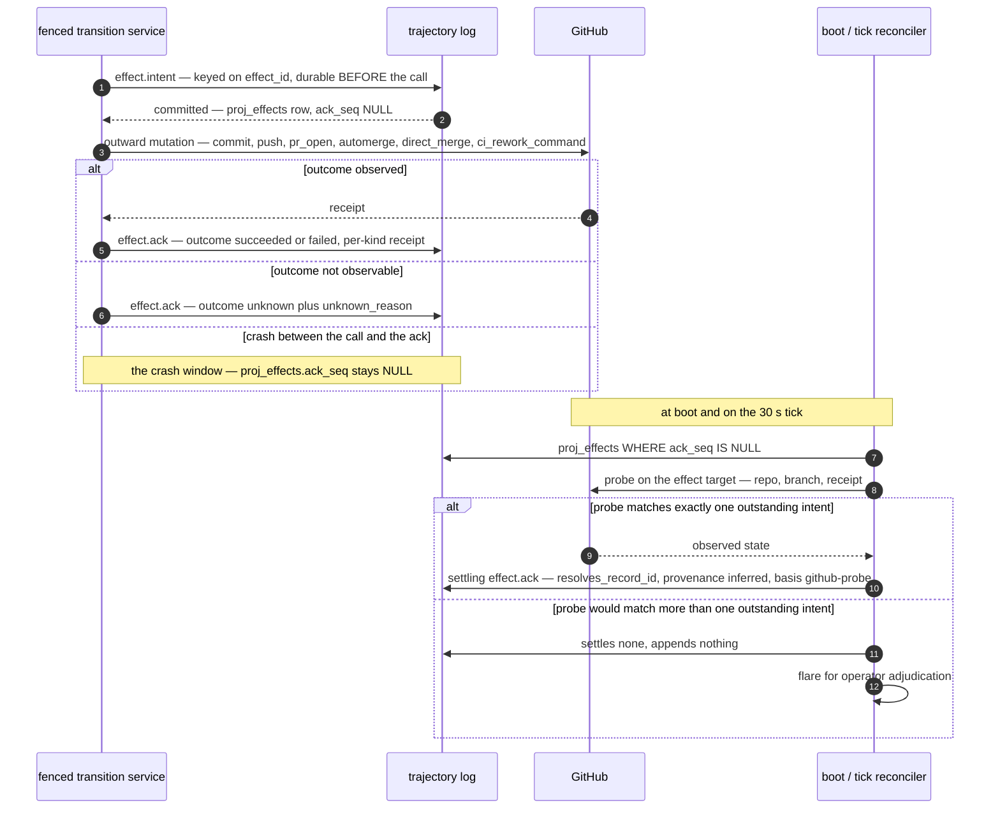

## Family 5 — step and molecule transitions

| record_type | Payload fields | Covers / notes |
|---|---|---|
| `molecule.poured` | formula✓, graph:JSON✓, node_count✓, graph_digest✓ | One record replaces the ~6k-bead pour; the per-edge cycle-CTE path (tg-ehht) leaves the write path. `step.crumb` retires. Fold flattens **blocks/validates** edges into `proj_step_edges` at pour. |
| `step.transition` | state:enum(pending,running,ready,complete,failed,gated)✓, cause:enum(scheduled,allocation,route,gate_cleared,rearm,recovery), started_at/ready_at/completed_at, cooldown_until (absent means absent), restart_budget, failure_reason, failure_class:enum(work,store_unavailable,unknown), result:JSON; env incarnation✓, attempt_id | Covers running/ready/complete/failed/rearmed + the step half of `step.gated`. Rearm (`cause='gate_cleared'`) bumps `step_round`, killing the I-14 stale-join loop — and, like every `step_round` bump, writes the predecessor P2 row's `superseded_by_step_round` with the cause on the new record's payload, so the chain row 15 walks is unbroken across a rearm boundary (audit round 2). |
| `step.superseded` | cause✓, budget_remaining✓, old_step_round✓, new_step_round✓ | Bumps envelope `step_round` only. **Restated unambiguously (fatal 4): the successor keeps the path and bumps `step_round`.** Supersession is **not an edge** — the chain is linear per path and lives as `superseded_by_step_round` on `proj_step_cursor` (§4); `proj_step_edges` carries blocks/validates only, so the second supersede of a path cannot collide on an edge PK, and row 15's closure orders the chain by step_round. The chain rule is general (audit round 2): EVERY `step_round` bump — this record AND the gate-cleared rearm — writes the predecessor's `superseded_by_step_round`, cause on the new record's payload. Exhaustion parks via `attempt.terminal(escalated)`. |
| `gate.opened` / `gate.regated` / `gate.closed` | gate_bead_id✓, node✓, reason (≤16 KB), regate_cycle, close_cause:ENUM(session-terminal,work-bead-closed,superseded-round,duplicate-mint,straggler-route,adjudicated,cap-released,unclassified) ✓on closed, actor, open_duration_ms | Gate bead stays L, stamped once at mint with attempt_id + opening record_id (gap 7 closes). Regate history is per-cycle records; the bead's reason gets a courtesy refresh — **which, like every service bd write, is epoch-stamped and read back** (§5). 554/601 causeless closes cannot recur. |
| *(retired)* | | `molecule.reaped` — **R** (the falsifier). `reap.backfill.hard-delete` — **R**. Wedge/ring/status/events rows — **R**, re-served from the fold. `flare.*` — the type vocabulary, not a separate record (Q6). |

## 2.6 Payload-schema governance

One package (`grid_trajectory`): `sealed class TrajectoryRecord` with a
`(record_type, type_version) → fromJson` codec registry. Rules: (1) within a version, changes are
additive-only with defaults; readers ignore unknown keys. (2) Breaking changes mint
`type_version+1`; old decoders are kept forever — the log is never migrated. (3) Unknown
`(type, version)` decodes to `OpaqueRecord` carrying raw JSON — replay never throws; the fold
records the skip in `proj_meta.skipped`. (4) Every type version ships a golden JSON fixture with a
round-trip test; CI diffs fixtures. (5) Fold code declares the `(type, min_version, max_version)`
set it consumes, checked at boot. (6) Required-field invariants live in the sealed classes'
constructors; the cross-cutting ones are additionally CHECK-enforced on promoted envelope columns
(§4) — **empirically real, not aspirational: probe T2 shows the five probe-era CHECKs refuse at
write time by name, ENUM columns fail closed under strict mode; the DDL now carries seven —
`ck_grant_link` and `ck_seat` are new since the probe, and the stage-0 CI guard pins their
refusal behavior alongside the measured five.** (7) **Envelope-construction rules** the codec
enforces on every append: `seat` derived from the work bead's store prefix whenever
`work_bead_id` is set; `station`/`authority_id`/`boot_epoch`/`source` stamped by the service, never
by the caller.

---

# 3 Attempt identity (Q1)

**Attempt = one process incarnation.** The parent ladders are first-class scopes, each its own key,
none derived, none encoded in mutable strings — and the two round ladders are separate columns:

```
work_bead_id                                   — bd, immutable forever (no #rN, no #void-)
 └─ mount_attempt_id : CHAR(26) ULID           — pre-session admission ladder
                                                 (minted per admission evaluation,
     └─ session_id : bd bead id                   grant OR refusal — gap 8 closes;
         │                                        uniqueness rides the ULID itself —
         │                                        proj_admission COUNTS attempts)
         └─ round : INT                        — session REWORK ladder (attempt.round.retired)
             └─ step_path                      — successors KEEP the path (fatal 4)
                 └─ step_round : INT           — chain ladder per path (step.superseded
                                                 OR gate-cleared rearm — §1, §2 F5)
                     └─ attempt_id : CHAR(26)  — one process incarnation
                        UNIQUE (session_id, round, step_path, step_round, incarnation)
                          — enforced as uq_incarnation on proj_process_identity (§4)
```

*The same ladder as a graph. The two round ladders are the shaded nodes — `round` is the session
rework ladder, `step_round` the per-path chain ladder; neither ever writes the other's counter.*

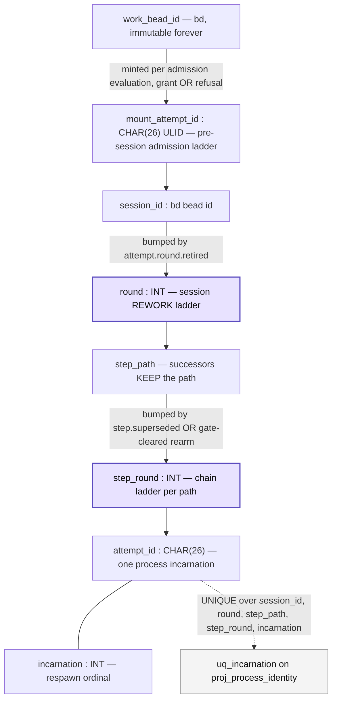

* `attempt_id` **is** the lease token, is exported into the child process env (replacing
  `GRID_INSTANCE_TOKEN`), and reduces the ValueKey `'$path#$restartCount#g$round'` to a render key.
  Fences reference it directly, per the decision's consequence clause.
* **The respawn rule (minor fix, now consistent with `attempt.process.exited`):** a respawn ENDS
  the attempt — `exit_kind='respawned'` is that attempt's terminal shape. The supervisor mints a
  successor attempt at `incarnation+1` whose `attempt.process.started` names
  `predecessor_attempt_id`. One incarnation, one attempt_id, one terminal-guard row, no exception.
* Session-level lifecycle records use a session-scoped attempt row: `step_path=''`, `step_round=0`,
  `incarnation` = respawn ordinal — one shape, no special case.
* A rework round re-pours the molecule; `step_round` restarts at 0 within the new `round`. Neither
  ladder ever writes the other's counter (red-team hold: probed, no collision constructible).

---

# 4 Table DDL

Dolt/MySQL dialect, **verified verbatim-accepted by dolt 2.2.2 (probe T1)** — including the ENUMs,
JSON NOT NULL, DATETIME(6), named CHECKs, and index set. **`dolt_ignore` registration is the first
DDL statement executed** (red-team hold: correctly sequenced; probe T3 validates the semantics).
All of this lives in the **`trajectory` database**, a sibling of the ledger database on the same server
(§10) — `USE trajectory` precedes everything below.

```sql
-- ── STEP 0, before anything else ─────────────────────────────
INSERT INTO dolt_ignore VALUES ('proj_%', true), ('traj_pulse', true), ('traj_fence', true);
-- traj_fence is WORKING-SET state (audit round 2): rebuilt at boot, never committed —
-- see its comment below. The status-clean CI guard (§9 Stage 0) therefore holds.

-- ── epoch history + the enforceable fence (Q15, probe T6) ────
CREATE TABLE traj_epoch (
  station     VARCHAR(64)  NOT NULL,
  epoch       BIGINT       NOT NULL,
  pid INT NOT NULL, pgid INT NOT NULL,
  cause       ENUM('boot','steal') NOT NULL,
  advanced_at DATETIME(6)  NOT NULL,
  PRIMARY KEY (station, epoch)      -- per-station epoch line (major fix): a second
);                                  -- station gets its own sequence, starving nobody.
-- append-only; MAX(epoch) WHERE station=? is that station's current authority epoch.
-- The claim is a single INSERT of MAX+1: probe T6c shows the LOSER of a concurrent
-- claim sees MySQL error 1213 (serialization failure) — dolt's write-write conflict
-- detection arbitrates, NOT the PK. The claim path handles 1213 (re-read MAX, retry
-- or refuse) and must NOT be written to catch 1062.

CREATE TABLE traj_fence (           -- THE PRIMARY FENCE (probe T6i: measured enforceable)
  station     VARCHAR(64) NOT NULL PRIMARY KEY,   -- one cell per station
  fence_state BIGINT      NOT NULL                -- (epoch << 32) | appender counter
);
-- Both the appender (monotonic low-bits increment, every append txn) and the
-- epoch-advancer (sets (new_epoch << 32)) write THIS ONE CELL. Dolt's conflict unit
-- is the cell, and same-cell different-value writes conflict at COMMIT (error 1213)
-- in both interleavings — measured, both directions, zero stale appends landed (T6i).
-- WORKING-SET state, dolt_ignore'd (audit round 2; seeded + guarded, cert round):
-- the cell is written as an UPSERT (INSERT .. ON DUPLICATE KEY UPDATE), never a bare
-- UPDATE, by exactly two writers: the epoch CLAIM path (which therefore SEEDS the row
-- on a fresh grid home or after trap recovery — a 0-row CAS match on the append path
-- stays an unambiguous fenced-out signal) and a reconnect whose boot_epoch still
-- equals MAX(traj_epoch.epoch); a reconnecting process whose epoch is stale goes
-- INERT without touching the cell (an unguarded reinit would be a stale process's
-- write into the live authority's fence). Losing the cell to restore/rebuild is
-- harmless — the next claim or guarded reconnect re-seeds it; the absolute counter
-- value carries no meaning. Never staged; the status-clean guard stays true.
-- Post-steal steady state: a txn that BEGINS after a steal committed reads the new
-- epoch in its snapshot, so the CAS matches 0 rows — that 0-row match IS the
-- fenced-out signal (§5 step 1); no cell write happens and no conflict can fire.

-- ── the log ──────────────────────────────────────────────────
CREATE TABLE trajectory (
  seq              BIGINT       NOT NULL AUTO_INCREMENT PRIMARY KEY,
  boot_epoch       BIGINT       NOT NULL,
  epoch_seq        BIGINT       NOT NULL,
  record_id        CHAR(26)     NOT NULL,
  idem_key         CHAR(64)     NOT NULL,     -- SHA-256 hex of the canonical grammar string
  idem_key_text    VARCHAR(512) NOT NULL,     -- the string itself, non-unique, greppable
  family           ENUM('attempt','admission','verification','effect','step') NOT NULL,
  record_type      VARCHAR(48)  NOT NULL,
  type_version     SMALLINT     NOT NULL DEFAULT 1,
  occurred_at      DATETIME(6)  NOT NULL,
  recorded_at      DATETIME(6)  NOT NULL,
  station          VARCHAR(64)  NOT NULL,
  seat             VARCHAR(64)  NULL,
  authority_id     VARCHAR(64)  NOT NULL,
  fencing_token    BIGINT       NULL,
  provenance       ENUM('observed','inferred','reconstructed') NOT NULL DEFAULT 'observed',
  provenance_basis VARCHAR(128) NULL,
  source           VARCHAR(160) NOT NULL,
  resolves_record_id CHAR(26)   NULL,
  work_bead_id     VARCHAR(40)  NULL,
  session_id       VARCHAR(40)  NULL,
  round            INT          NULL,
  step_round       INT          NULL,
  step_path        VARCHAR(255) NULL,
  incarnation      INT          NULL,
  attempt_id       CHAR(26)     NULL,
  mount_attempt_id CHAR(26)     NULL,
  grant_id         CHAR(26)     NULL,
  effect_id        CHAR(64)     NULL,      -- SHA-256 hex of the canonical effect string (§1)
  gate_id          VARCHAR(64)  NULL,
  worktree         VARCHAR(255) NULL,
  branch           VARCHAR(160) NULL,
  commit_sha       CHAR(40)     NULL,
  receipt          VARCHAR(255) NULL,
  expires_at       DATETIME(6)  NULL,
  outcome          ENUM('succeeded','failed','cancelled','lost','escalated','settled','unknown') NULL,
  unknown_reason   VARCHAR(32)  NULL,
  payload          JSON         NOT NULL,
  UNIQUE KEY uq_record_id (record_id),
  UNIQUE KEY uq_idem      (idem_key),
  UNIQUE KEY uq_epoch_seq (station, boot_epoch, epoch_seq),   -- station-scoped (major fix)
  KEY ix_bead    (work_bead_id, seq),
  KEY ix_session (session_id, seq),
  KEY ix_attempt (attempt_id, seq),
  KEY ix_step    (session_id, round, step_path, step_round, seq),
  KEY ix_type    (record_type, seq),
  KEY ix_effect  (effect_id),
  KEY ix_gate    (gate_id, seq),
  KEY ix_sha     (commit_sha),
  KEY ix_receipt (receipt),
  KEY ix_fence_token (fencing_token),
  CONSTRAINT ck_prov      CHECK (provenance = 'observed' OR provenance_basis IS NOT NULL),
  CONSTRAINT ck_terminal  CHECK (record_type <> 'attempt.terminal' OR outcome IS NOT NULL),
  CONSTRAINT ck_unknown   CHECK (outcome IS NULL OR outcome <> 'unknown' OR unknown_reason IS NOT NULL),
  CONSTRAINT ck_provision CHECK (record_type <> 'worktree.provisioned'
                                 OR (commit_sha IS NOT NULL AND branch IS NOT NULL)),
  CONSTRAINT ck_grant     CHECK (record_type <> 'admission.grant.issued'
                                 OR (grant_id IS NOT NULL AND expires_at IS NOT NULL
                                     AND fencing_token IS NOT NULL)),
  CONSTRAINT ck_grant_link CHECK (record_type NOT IN
                                  ('admission.grant.consumed','admission.grant.expired',
                                   'admission.grant.released','attempt.session.started')
                                 OR grant_id IS NOT NULL),
  CONSTRAINT ck_seat      CHECK (work_bead_id IS NULL OR seat IS NOT NULL)
);

-- one UNSETTLED terminal per attempt, structurally, even under a key-grammar bug —
-- while PERMITTING the settlement chain (major fix):
CREATE TABLE traj_terminal_guard (
  attempt_id CHAR(26) NOT NULL PRIMARY KEY,
  seq        BIGINT   NOT NULL,       -- the latest terminal in the chain
  settled_by CHAR(26) NULL            -- record_id of the resolving terminal, if any
);
-- Rule: an attempt.terminal with resolves_record_id IS NULL INSERTs (a second
-- independent terminal fails the PK — the invariant footnote 1 argued for, kept).
-- A SETTLING terminal (resolves_record_id set, pointing at the prior terminal)
-- UPDATEs seq + settled_by instead of inserting. "No two independent terminals"
-- holds; "unknown, then healed" (Q8) is finally possible for attempts, not just acks.

-- coalesced liveness pulses: dolt_ignore'd, working-set only, NON-rebuildable,
-- never an admission input; ≥30s per subject; also carries federation lease beats
CREATE TABLE traj_pulse (
  subject_id  VARCHAR(64) NOT NULL,   -- attempt_id OR lease id (renamed; major fix)
  kind        ENUM('attempt','lease') NOT NULL,
  boot_epoch  BIGINT      NOT NULL,   -- the epoch this beat was observed under
  beat_at     DATETIME(6) NOT NULL,
  observed_via ENUM('runtime','worktree-mtime','vm-service','wire') NOT NULL,
  PRIMARY KEY (subject_id, kind)      -- one row per subject: UPSERT, not history
);
-- Contract (major fix): TRUNCATED at epoch advance; rows DELETEd when the subject
-- reaches a settled terminal (the prune rule); the liveness detector may emit
-- attempt.liveness.lost ONLY for a subject whose beat it observed within the
-- CURRENT epoch — no prior observed beat ⇒ state is `unknown`, and unknown is a
-- state the DETECTOR honours, not merely one the wedge renders.

-- fold bookkeeping
CREATE TABLE proj_meta (
  projection   VARCHAR(32) NOT NULL PRIMARY KEY,
  fold_version INT         NOT NULL,
  applied_seq  BIGINT      NOT NULL,
  skipped      JSON        NULL,
  rebuilt_at   DATETIME(6) NULL
);

-- ── projections (all dolt_ignore'd, all rebuildable) ─────────
CREATE TABLE proj_session_head (          -- P1
  session_id VARCHAR(40) NOT NULL PRIMARY KEY,
  work_bead_id VARCHAR(40) NOT NULL,
  round INT NOT NULL DEFAULT 0,
  status ENUM('open','closed') NOT NULL,
  outcome ENUM('succeeded','failed','cancelled','lost','escalated','settled','unknown') NULL,
  work_terminal_reason VARCHAR(255) NULL,
  held TINYINT(1) NOT NULL DEFAULT 0, held_reason VARCHAR(512) NULL,
  pgid INT NULL, pid INT NULL, attempt_id CHAR(26) NULL,
  rig VARCHAR(64) NULL, model VARCHAR(32) NULL,
  seat VARCHAR(64) NULL,
  started_at DATETIME(6) NOT NULL, closed_at DATETIME(6) NULL,
  head_epoch BIGINT NOT NULL,             -- last epoch whose bd head-stamp succeeded (§5/§7)
  last_seq BIGINT NOT NULL,
  KEY ix_bead (work_bead_id, status)
);

CREATE TABLE proj_step_cursor (           -- P2 — round-bearing, TWO-ladder key
  session_id VARCHAR(40) NOT NULL, round INT NOT NULL,
  step_path VARCHAR(255) NOT NULL, step_round INT NOT NULL,
  state ENUM('pending','running','ready','complete','failed','gated') NOT NULL,
  incarnation INT NOT NULL, attempt_id CHAR(26) NULL,
  superseded_by_step_round INT NULL,      -- the step_round CHAIN (fatal 4): linear per
                                          -- path, ordered by step_round — no edge rows;
                                          -- written on EVERY bump: step.superseded AND
                                          -- gate-cleared rearm (audit round 2)
  cooldown_until DATETIME(6) NULL, restart_budget INT NULL,
  started_at DATETIME(6) NULL, ready_at DATETIME(6) NULL, completed_at DATETIME(6) NULL,
  failure_class VARCHAR(24) NULL, result JSON NULL, last_seq BIGINT NOT NULL,
  PRIMARY KEY (session_id, round, step_path, step_round),
  KEY ix_state (state, cooldown_until)
);

CREATE TABLE proj_step_edges (            -- flattened at pour; blocks/validates ONLY
  session_id VARCHAR(40) NOT NULL, round INT NOT NULL,   -- (supersedes moved to the
  from_path VARCHAR(255) NOT NULL, to_path VARCHAR(255) NOT NULL,  -- cursor column);
  kind ENUM('blocks','validates') NOT NULL,              -- no recursive CTE (tg-ehht)
  PRIMARY KEY (session_id, round, from_path, to_path, kind)
);

CREATE TABLE proj_verification (          -- P5 — now carries the FULL two-ladder key
  session_id VARCHAR(40) NOT NULL, round INT NOT NULL,   -- (fatal 3): superseded
  step_path VARCHAR(255) NOT NULL, step_round INT NOT NULL,  -- grades are HISTORY,
  lane VARCHAR(64) NOT NULL,                                 -- never overwritten
  attempt_id CHAR(26) NULL, incarnation INT NULL,        -- attribution (fatal 3 fix)
  grade CHAR(1) NULL, transport VARCHAR(16) NULL,
  rationale_digest CHAR(64) NULL, source_record_id CHAR(26) NULL,
  verdict_sha CHAR(40) NULL, pinned_head_sha CHAR(40) NULL, sha_drift TINYINT(1) NULL,
  gating_rc INT NULL, gating_plan_digest CHAR(64) NULL, gating_head_sha CHAR(40) NULL,
  route_verdict VARCHAR(16) NULL, route_rule VARCHAR(64) NULL,
  pr_url VARCHAR(255) NULL, pr_number INT NULL, reused TINYINT(1) NULL,
  auto_merge VARCHAR(24) NULL, validation_rc INT NULL,
  ci_conclusion VARCHAR(24) NULL, ci_head_sha CHAR(40) NULL,
  tokens_in INT NULL, tokens_out INT NULL, cost_usd DECIMAL(10,4) NULL,
  last_seq BIGINT NOT NULL,
  PRIMARY KEY (session_id, round, step_path, step_round, lane),
  KEY ix_session_round (session_id, round)
);  -- SYNCHRONOUS: updated in the append transaction. Consumers pick their ladder
    -- position explicitly: row 19 (route join) reads the LATEST step_round per
    -- (path, lane); rows 8 and 11 (spent rounds, false-F rollups) read the CHAIN.

CREATE TABLE proj_admission (             -- P3 — grants, budgets, cap state
  work_bead_id VARCHAR(40) NOT NULL PRIMARY KEY,
  open_grant_id CHAR(26) NULL,            -- the _mountedIds successor
  grant_expires_at DATETIME(6) NULL,
  fencing_token BIGINT NULL,
  mount_attempts INT NOT NULL DEFAULT 0,  -- reset rule: never (append-only count);
  mint_attempts INT NOT NULL DEFAULT 0,   -- the CAP compares against attempts SINCE
  cap_release_seq BIGINT NULL,            -- the last cap-release restore (this column)
  capped TINYINT(1) NOT NULL DEFAULT 0,
  last_seq BIGINT NOT NULL
);

CREATE TABLE proj_admission_clause (      -- P3 — per-clause refusal LEVELS
  work_bead_id VARCHAR(40) NOT NULL,
  clause VARCHAR(48) NOT NULL,
  refused TINYINT(1) NOT NULL,            -- latest refusal/restore pair wins, by seq
  snapshot_rev VARCHAR(64) NULL,
  refusal_record_id CHAR(26) NULL,
  last_seq BIGINT NOT NULL,
  PRIMARY KEY (work_bead_id, clause)
);

CREATE TABLE proj_gate (                  -- P4
  gate_id VARCHAR(64) NOT NULL PRIMARY KEY,
  session_id VARCHAR(40) NOT NULL, work_bead_id VARCHAR(40) NULL,
  step_path VARCHAR(255) NOT NULL, step_round INT NOT NULL, attempt_id CHAR(26) NULL,
  state ENUM('open','closed') NOT NULL,
  opened_at DATETIME(6) NOT NULL, closed_at DATETIME(6) NULL,
  close_cause VARCHAR(32) NULL, close_actor VARCHAR(64) NULL,
  regate_count INT NOT NULL DEFAULT 0, regated_at DATETIME(6) NULL,
  reason_digest CHAR(64) NULL,
  ledger_ack_seq BIGINT NULL,             -- last seq whose bd-side write was READ BACK
                                          -- OK (major fix: the bd half is a tracked
                                          -- obligation with its own retry, §5)
  last_seq BIGINT NOT NULL,
  KEY ix_session (session_id, state)
);

CREATE TABLE proj_gate_cycles (           -- P4-cycles — per-cycle regate history (row 9)
  gate_id VARCHAR(64) NOT NULL, cycle INT NOT NULL,
  opened_record_id CHAR(26) NOT NULL,
  opened_at DATETIME(6) NOT NULL, closed_at DATETIME(6) NULL,
  close_cause VARCHAR(32) NULL, reason_digest CHAR(64) NULL,
  PRIMARY KEY (gate_id, cycle)
);

CREATE TABLE proj_process_identity (      -- P6 — live leases/fences/worktrees (rows 3/10/13/32)
  attempt_id CHAR(26) NOT NULL PRIMARY KEY,
  session_id VARCHAR(40) NOT NULL, round INT NOT NULL,
  step_path VARCHAR(255) NOT NULL, step_round INT NOT NULL, incarnation INT NOT NULL,
  pid INT NULL, pgid INT NULL,
  lease_state ENUM('held','released','swept') NULL,
  worktree VARCHAR(255) NULL, branch VARCHAR(160) NULL,
  base_sha CHAR(40) NULL, adopted_existing TINYINT(1) NULL,
  worktree_state ENUM('live','reaped','held') NULL,
  predecessor_attempt_id CHAR(26) NULL,
  last_seq BIGINT NOT NULL,
  UNIQUE KEY uq_incarnation (session_id, round, step_path, step_round, incarnation),
  -- ^ §3's ladder-uniqueness constraint, enforced HERE (cert round: it was stated
  --   in §3 but implemented by no table)
  KEY ix_session (session_id), KEY ix_worktree (worktree)
);  -- liveness is NOT a column here: it reads traj_pulse, is `unknown` after
    -- restore/epoch-advance, and is never an admission input.

CREATE TABLE proj_effects (               -- the outstanding-intent index
  effect_id CHAR(64) NOT NULL PRIMARY KEY,        -- the hash (§1)
  effect_id_text VARCHAR(512) NOT NULL,           -- the raw canonical string, non-unique,
                                                  -- greppable — same discipline as idem_key_text
  kind VARCHAR(24) NOT NULL, intent_seq BIGINT NOT NULL,
  target_repo VARCHAR(160) NULL, target_branch VARCHAR(160) NULL,  -- the probe join
  ack_seq BIGINT NULL,                    -- NULL ⇒ OUTSTANDING ⇒ reconciler probes
  outcome VARCHAR(16) NULL, unknown_reason VARCHAR(32) NULL,
  settled_by CHAR(26) NULL, resolve_count INT NOT NULL DEFAULT 0,
  pr_url VARCHAR(255) NULL, pr_number INT NULL, pushed_sha CHAR(40) NULL,
  KEY ix_outstanding (ack_seq)
);

CREATE TABLE proj_leases (                -- P9 — OWNER-side federation lease state (row 31;
  lease_id VARCHAR(64) NOT NULL PRIMARY KEY,      -- audit round 2). Folded from
  lessee VARCHAR(64) NOT NULL,                    -- federation.lease.granted/.reaped/.expired;
  kind VARCHAR(24) NOT NULL,                      -- P6 stays process identity — an owner-side
  fencing_token BIGINT NOT NULL,                  -- lease is not an attempt and never lands there.
  granted_seq BIGINT NOT NULL,
  expires_at DATETIME(6) NOT NULL,
  state ENUM('granted','reaped','expired') NOT NULL,
  KEY ix_lessee (lessee, state)
);  -- lease validity for station_server.dart's per-wire-request fence check is a PK hit
    -- here, never a trajectory scan; beats stay in traj_pulse (kind='lease').

CREATE TABLE proj_command_dedupe (        -- P8 — keyed on the WIRE key (major fix)
  wire_key VARCHAR(160) NOT NULL PRIMARY KEY,
  fingerprint VARCHAR(128) NOT NULL,      -- first-seen fingerprint
  fence BIGINT NOT NULL, seq BIGINT NOT NULL,
  conflict_count INT NOT NULL DEFAULT 0   -- bumped per effect.command.refused —
);                                        -- the same-key/different-body conflict SURFACES

CREATE TABLE proj_telemetry (             -- P7 — the ONE deliberately trailing projection
  session_id VARCHAR(40) NOT NULL, round INT NOT NULL,
  step_path VARCHAR(255) NOT NULL, step_round INT NOT NULL,
  model VARCHAR(32) NULL, tokens_in BIGINT NULL, tokens_out BIGINT NULL,
  cost_usd DECIMAL(10,4) NULL, premium_requests INT NULL,
  num_turns INT NULL, duration_ms BIGINT NULL,
  last_seq BIGINT NOT NULL,
  PRIMARY KEY (session_id, round, step_path, step_round)
);  -- nothing in it is a decision input; folded async.
```

*The projection layer: every table above with its PK, and the contract rows (§6) that read it.
Row numbers are the §6 mapping, not columns. P7 is the one deliberately trailing projection;
everything else folds inside the append transaction.*

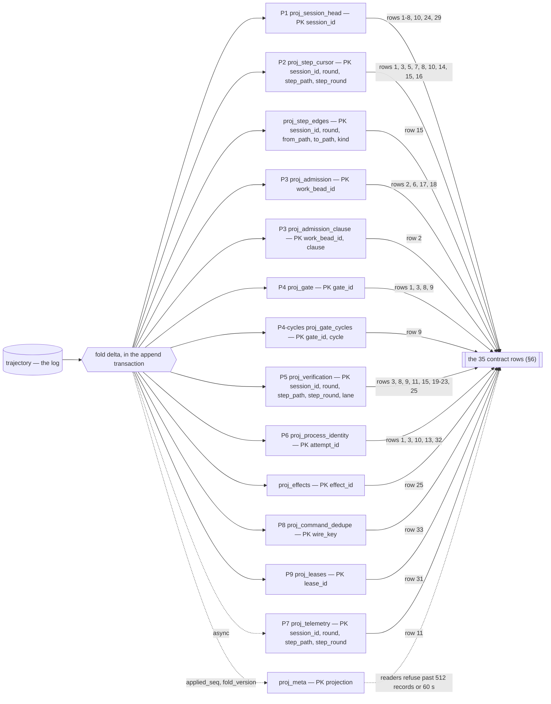

**Forensics view:** the station runner's `traj show <bead|session|attempt>` verb renders
`SELECT … FROM trajectory WHERE work_bead_id=? ORDER BY seq` with **its own typed payload
formatting** — probe T8 corrected the draft's assumption: dolt renders a one-key JSON change as the
entire row twice (whole payload on each side), so `traj show` never delegates rendering to
`dolt diff`. One table, one query; the five-way-join defect stays dissolved.

---

# 5 Append discipline

**Write path.** Every durable transition is a request to the fenced transition service:
`{request_id, fencing_token, boot_epoch, record(s)}`. One append = **one SQL transaction**:

1. **Fence — the T6i counter-CAS, measured enforceable (probe T6i, both interleavings, zero stale
   appends).** Inside the txn the appender runs
   `UPDATE traj_fence SET fence_state = fence_state + 1 WHERE station = ? AND (fence_state >> 32) = <boot_epoch>`.
   Three properties, all load-bearing: (i) ONE cell that both the appender and the epoch-advancer
   write; (ii) the appender's write always changes the value (the monotonic low-bits counter);
   (iii) **the affected-row count is an ASYMMETRIC signal** (audit round 2 — replacing this
   revision's blanket "never the affected-row count" ban, which left the post-steal steady state
   unfenced): **0 rows ALWAYS means fenced out — refuse immediately.** A transaction that BEGINS
   after a steal committed reads the new epoch in its snapshot, the CAS predicate matches nothing,
   no cell write happens, and no conflict can ever fire — the 0-row match is the only signal that
   path produces, and it is definitive. **1 row is NEVER proof of holding the fence** (probe T6d:
   the CAS predicate matched 1 row after the steal had committed — snapshot-blind): on 1 row the
   appender proceeds to COMMIT, where **error 1213 arbitrates** the contended interleavings
   (measured, both directions, zero stale appends — T6i). `SELECT … FOR UPDATE` is
   **measured dead** on dolt 2.2.2 — parsed and silently ignored in both row-targeting and
   aggregate forms (T6b); no code may be written against it. A read-only fence check is invisible
   to dolt's conflict detection (T6a) — the draft's "measured tg-zfek item" is now measured, and
   the answer without the CAS is no.
   *Bit-width note:* the fence/token encoding is `(epoch << 32) | counter` — the draft's `<< 20`
   gave ~1M appends per epoch (~7 h at measured storm tempo) before the counter carried into the
   epoch bits; 32 low bits give 4B. Logged in §14.
2. Additionally assert the **belt predicates**: `boot_epoch` ≥ the previous row's (non-decreasing
   over seq — the alarm fatal 1 demanded, now stated); grant-scoped writes match the grant row's
   `fencing_token` and `expires_at > NOW(6)`. **A belt violation has a handler** (audit round 2):
   a non-decreasing-epoch violation or a seq/epoch_seq disagreement is the **corruption-halt
   alarm class** — see the error contract below.
3. Insert the `trajectory` row (assigning `seq` and `epoch_seq` at commit, in the same serialized
   stream).
4. Insert/update `traj_terminal_guard` for terminals (insert if unsettled, update if settling).
5. **Apply the fold delta to every synchronous projection in the same transaction.** Visibility
   rides the SQL commit, not the dolt commit.

*One append through the fenced service, steps 1–5 in one SQL transaction, with the three error
classes as branches. Bit-shift arithmetic is elided — the CAS statement is quoted in full in step 1
of the prose above, and the belt predicates in step 2.*

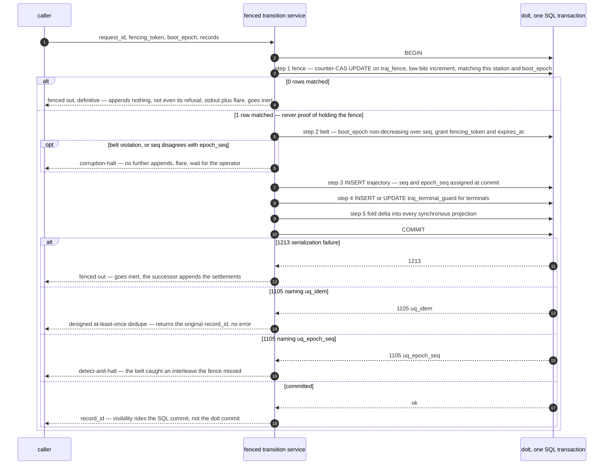

**Error contract (probe T6c/T6f, plus the belt's alarm class — three distinct classes, never
conflated):** `1213` = serialization failure — on the epoch-claim path: re-read MAX(epoch), retry
or refuse; on the append path: **fenced out** — go inert (below). A **0-row fence-CAS match** is
the same fenced-out disposition, reached without a conflict (step 1's asymmetry). `1105` =
unique-violation at commit — **branch on the constraint named in the error** (cert round): a
`uq_idem` violation is the DESIGNED at-least-once dedupe (return the original `record_id`, no
error, no halt); a `uq_epoch_seq` violation is the belt catching an interleave the fence somehow
missed: **detect-and-halt**. **Corruption-halt (audit round 2):** a non-decreasing-epoch belt violation or
a seq/epoch_seq disagreement is a named corruption alarm class — the service **HALTS** (no further
appends), flares, and requires operator intervention; the log is presumed damaged until a human has
looked, because both predicates can only fail if something already committed out of order. `@@dolt_force_transaction_commit` is
**banned on every service connection** (asserted at connect) — dolt's own 1105 error text advertises
it as the way to commit anyway, and setting it would silently disable the belt (T6f). Note the
belt's honest scope (T6e): two appenders writing *different* rows do not conflict on the table
itself — the belt catches same-`epoch_seq` collisions only, which is exactly why the counter-CAS is
primary and the belt is a belt.

**Statement-time 1062 (measured, stage-0 build):** dolt 2.2 surfaces a `uq_idem` duplicate that is
already visible in the session's snapshot at STATEMENT time as **error 1062 naming the duplicate
VALUE** — not at COMMIT as a constraint-named 1105; the concurrent-commit shape remains 1105 naming
the constraint, and both are handled. The 1062 message does not say which unique key fired, so the
appender arbitrates by probe: a 1062 whose idem-key probe finds our own key in the log is the
DESIGNED at-least-once dedupe (return the original `record_id`); a 1062 with no matching row is the
belt's `epoch_seq`/`record_id` class — **corruption-halt**. 1062 is never caught on the epoch-claim
path (the PK is not the arbiter there; seeing it means something is structurally wrong).

**Fenced-out behavior (major fix — the draft's self-contradiction deleted).** A fenced-out appender
**appends nothing** — not even its own refusal; its next append fails the identical fence,
recursively, which is the same physics as the losing booter (§2 F2, held). The honest contract:
(a) it does not proceed with any outward mutation whose intent failed to append; (b) it abandons
in-flight effects at the next safe point without acking them; (c) it emits stdout + flare; (d) it
goes inert. The **successor** authority appends `authority.epoch.advanced(cause='steal', …)` and the
settlement records for whatever it finds outstanding (`proj_effects` intents, open grants). No
remote mutation can outlive the record that at least asks about it (red-team hold:
intent-before-mutation is structural; unchanged).

**Epoch claim.** A single atomic `INSERT INTO traj_epoch (station, epoch=MAX+1 WHERE station=?)`
under the station lock's exclusive-create, followed by the fence-cell **UPSERT**
(`INSERT .. ON DUPLICATE KEY UPDATE fence_state = (new_epoch << 32)` — the claim path is also
what seeds the row on a fresh home, cert round). The lock supplies mutual exclusion; the epoch row supplies
history; **the fence cell supplies enforcement**. Probe holds: the claim genuinely serializes
concurrent booters (loser sees 1213, not 1062); a crash after the INSERT but before the first
append is benign (the orphaned row raises MAX; no stale process can match the fence).
**The fence cell is working-set state, dolt_ignore'd and rebuilt, never restored** (audit
round 2; guarded, cert round): on (re)connect the service re-reads `MAX(traj_epoch.epoch)` —
if it still equals its own `boot_epoch` it re-seeds the cell by UPSERT; if not, it is stale and
goes **inert without touching the cell** (an unconditional reinit would let a bounced stale
process write the live authority's fence and drive it inert via a spurious 1213). The cell's
absolute counter value carries no meaning beyond same-cell contention, so a restore, rebuild, or
trap-recovery losing it is harmless, and the status-clean CI guard (§9 Stage 0) holds because
the cell is never staged.

*The epoch/fence lifecycle: boot claim, the concurrent loser, the steal, and the two ways a stale
process is refused. Authority B plays the boot rival and then, later, the successor that steals —
the notes mark the phase change. Fence-state arithmetic is shown as "new epoch in the high bits".*

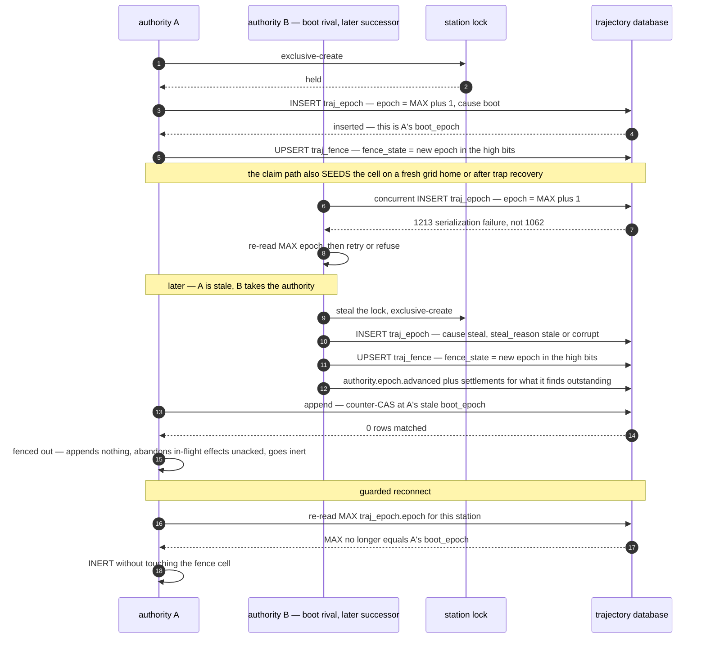

**The service tick (major fix — the undefined "next service tick" is now defined).**
* **Owner:** the fenced transition service itself — the durable arm of the
  `StationAdmissionAuthority`, mounted as a first-class seed in the tree (not a side loop; the
  tg-y4fd tripwire discussion in §2 F2 applies).
* **Interval:** every 30 s while resident (aligned with the dolt-commit cadence), plus immediately
  after any terminal append and at boot.
* **Fenced:** every repair append rides the same counter-CAS transaction as any other append — a
  fenced-out tick repairs nothing, correctly.
* **Work per tick, to fixpoint:** the derived-obligation queries below, plus the admission
  authority's **eligibility re-evaluation** (the `admission.refused`/`admission.restored` writer,
  §2 F2) — one tick, one owner, one fence. **Each obligation arms with its record family's stage**
  (audit round 2, §9): at Stage 1 the tick runs ONLY the attempt/step-family queries; the
  eligibility re-evaluation and the grant/admission queries join at Stage 3 with their family.
* **Clean down, defined:** the station's `down` verb runs the tick to fixpoint **before** appending
  `authority.epoch.closed`; the `.closed` record is the receipt that no obligation was left open.
  A down that cannot reach fixpoint (bd unreachable, GitHub unreachable) appends `.closed` with the
  outstanding-obligation count in its payload and flares — the successor boot's tick inherits the
  remainder. This bounds the harvest-then-down window the red-team named: the obligations for a
  landed session run before the process exits, same as today's inline tail, minus the crash window.
* **Build stage:** Stage 0 (substrate) builds the tick skeleton; Stage 1 populates the
  attempt/step-family queries; Stage 3 adds the admission family (§9).

**Follow-up repairs, not tails.** `attempt.terminal` is one record. The former tail members are
derived obligations — but **every obligation query keys off the EXTERNAL state it repairs, never
off the projection the repair itself mutates** (major fix: a failed bd write must keep the
obligation open, and both directions must exist for gates):

| Obligation query (keyed on external state) | Repair |
|---|---|
| P4 gates open under a terminal P1 session | append `gate.closed(cause='session-terminal')`, then bd close |
| **bd gate beads open whose P4 row is closed** (`ledger_ack_seq < last_seq`) | retry the bd close; the reverse-direction query the draft lacked |
| open `step.gated` in P2 without an open bd gate bead | idempotent gate-bead re-mint (not ordering luck) |
| terminal session with a live worktree in P6 | reap + append `worktree.reaped` |
| **any bead whose P6 shows a live worktree under a terminal session** | **admission refuses `clause='worktree-outstanding'`** — the barrier that makes repair lateness harmless (major fix). **Barrier timing (audit round 2):** the barrier LOGIC arms at Stage 1 as an eligibility clause in the legacy mount-gate path reading P6 (flare-only refusal, like today's clauses); it becomes a trajectory-recorded refusal at Stage 3 with its family (§9) |
| P1 head fields diverging from the bd head bead, or `head_epoch` stale | re-stamp head from P1 (§7) |
| `effect.intent` with `ack_seq NULL` in proj_effects | probe GitHub, append settling `effect.ack` |
| open grant past `expires_at` | append `admission.grant.expired` |
| previously-refused clause whose basis no longer holds | append `admission.restored{clause}` (per-clause, §2 F2) |

**bd-write policy for N failures:** a ledger-side repair that fails read-back `N=5` consecutive
ticks appends `attempt.note(channel='obligation-stuck')` and flares for the operator; the
obligation stays open (it is keyed on bd's state, so it cannot silently vanish).

**The service's bd writes are epoch-fenced too (major fix).** "Sole writer" was intent, not
mechanism, across the store boundary. Every service-originated bd write — gate close, gate
re-mint, courtesy reason refresh, head stamp — (a) carries `grid.head.epoch` / `grid.gate.epoch`
stamped with the writer's epoch, (b) is **refused when the bead already carries a higher epoch**
(monotonic, CAS-shaped: read, compare, conditional merge), and (c) is **read back** after every
text write, per standing doctrine (bead-text writes corrupt silently). A fenced-out authority's
stale bd writes lose to the successor's on the epoch compare instead of last-writer-wins.

**Idempotency — the full grammar, one row per record type, no exceptions (major fix).**
`idem_key = SHA-256(canonical string)`; `idem_key_text` carries the string. Duplicate insert hits
`uq_idem`; the service returns the original `record_id`.

| record_type | canonical grammar string |
|---|---|
| attempt.session.started | `session-started:<session_id>` |
| attempt.process.started | `proc-started:<attempt_id>` |
| attempt.process.exited | `proc-exited:<attempt_id>` |
| attempt.liveness.lost / .regained | `liveness:<attempt_id>:<last_beat_at µs>:<lost\|regained>` — keyed on the observed crossing |
| attempt.lease.acquired / .released | `lease:<attempt_id>:<acquired\|released>` |
| attempt.lease.swept | `lease-swept:<attempt_id>:<boot_epoch>` |
| attempt.adopt.proved | `adopt:<attempt_id>` |
| attempt.terminal | `terminal:<attempt_id>` (unsettled); `terminal-resolve:<attempt_id>:<resolves_record_id>` (settling) |
| attempt.round.retired | `round-retired:<session_id>:<old_round>` |
| attempt.rework_declined | `rework-declined:<session_id>:<round>` |
| attempt.mint.outcome | `mint:<work_bead_id>:<mount_attempt_id>:<phase>` |
| attempt.note | `note:<session_id>:<note_ordinal>` — service-minted ordinal, at-most-once accepted |
| worktree.provisioned | `wt-provisioned:<attempt_id>` |
| worktree.reaped | `wt-reaped:<session_id>:<worktree>` |
| worktree.held | `wt-held:<session_id>:<worktree>:<boot_epoch>` |
| admission.grant.issued / .consumed / .expired / .released | `grant:<grant_id>:<issued\|consumed\|expired\|released>` |
| admission.refused | `refused:<work_bead_id>:<clause>:<snapshot_rev>` — level-shaped |
| admission.restored | `restored:<work_bead_id>:<clause>:<refusal_record_id>` |
| admission.drive.approved | `drive:<station>:<boot_epoch>` |
| authority.epoch.advanced / .closed | `epoch:<station>:<epoch>:<advanced\|closed>` |
| federation.lease.granted / .reaped / .expired | `flease:<lease_id>:<granted\|reaped\|expired>` |
| verify.scope.pinned | `pin:<session>:<round>:<step_path>:<step_round>:<incarnation>` |
| verify.verdict.recorded | `verdict:<session>:<round>:<step_path>:<step_round>:<incarnation>:<lane>` |
| verify.verdict.recovered | `verdict-recovered:<session>:<round>:<step_path>:<step_round>:<lane>` |
| verify.gating.rc | `gating:<session>:<round>:<step_path>:<step_round>:<incarnation>` |
| verify.completion.fence | `fence-probe:<attempt_id>` |
| verify.route.verdict | `route:<session>:<round>:<step_path>:<step_round>:<incarnation>`; operator variant `route-operator:<gate_id>:<cycle>` |
| verify.usage.telemetry | `usage:<attempt_id>` |
| verify.ci.concluded | `ci:<observation_id>` |
| effect.intent | `effect:<effect_id>:intent` |
| effect.ack | `effect:<effect_id>:ack:<n>` — n=0 primary; resolving acks take n = proj_effects.resolve_count+1 (service-minted; a re-probe appending twice is harmless — the chain's latest wins) |
| effect.unarmed | `unarmed:<attempt_id>` |
| effect.observation.claimed | `obs:<observation_id>` |
| effect.command.received | `cmd:<wire-key>:<fingerprint>` — a different body IS a different record |
| effect.command.refused | `cmd-refused:<wire-key>:<fingerprint>` |
| effect.ci.rework.commanded | `github-ci:<bead>:r<N>:<check>:<obs>` |
| molecule.poured | `pour:<session>:<round>` |
| step.transition | `step:<session>:<round>:<path>:<step_round>:<incarnation>:<state>` |
| step.superseded | `supersede:<session>:<round>:<path>:<old_step_round>` |
| gate.opened / .regated / .closed | `gate:<gate_id>:opened` · `gate:<gate_id>:regate:<cycle>` · `gate:<gate_id>:closed:<cycle>` |

The pin/gating/verdict/route keys carry `<incarnation>`, matching `step.transition` (audit
round 2): a supervised restart within the same step_round re-pins against a new HEAD, re-runs the
gating rc, and re-grades — each MUST append as fresh evidence, never be swallowed as a successful
dedupe of incarnation 0's digests. P5's per-lane row takes the latest by seq, as before.

A type with no deterministic key is a type modelled wrong — the table is exhaustive by
construction, and a stage-0 test constructs a maximum-length key of every type (hashing makes
truncation impossible, but the test pins the canonical-string builder).

**No group commit.** Per-append transactions are the default for everything; the only coalesced
surface is `traj_pulse`. **Measured (probe T7):** bare append 8.4 ms; + one synchronous projection
16 ms; + the fence CAS ~23 ms (~42 appends/s); the full synchronous set (P1–P6+P8/P9 as applicable)
plausibly 35–45 ms ⇒ ~22–28 appends/s — comfortable for an 8-attempt storm at grid tempo, with a
thinner margin than the draft assumed. **The measured lever is the number of projection writes
inside the transaction (~7.5 ms each), not the transaction itself** — so the pre-authorized retreat
is re-scoped: before any batching, shrink the synchronous projection set (candidates: fold P4-cycles
and parts of P5's telemetry columns async); batching remains a last resort for provably
re-observable records only (§12, updated).

**Dolt-commit policy** (the 544,956-commit / 18 GB pathology — now with hard numbers): SQL
transactions per-append; dolt commits decoupled —
`CALL DOLT_ADD('trajectory','traj_epoch','traj_terminal_guard'); CALL DOLT_COMMIT('-m','traj: seq <A>..<B> epoch <E>')`
every 30 s, or 512 rows, or at boundary events (epoch advance, `attempt.terminal`,
`attempt.round.retired`) — **plus a hard minimum interval of 10 s between dolt commits regardless
of boundary events** (probe T7b: permanent history costs ~14.6 KB per commit, unreclaimable by gc;
commit COUNT, not row count, is the storage lever — 48× storage at per-row cadence for identical
data). Cadence overhead is ~4% (T7 B). **Operational rules from the probe:** commit counting is
`COUNT(*) FROM dolt_log` — never `DOLT_COMMIT`'s return, which is a silent no-op under
`--skip-empty` without a preceding `DOLT_ADD` (the T7 measurement trap); `dolt add --force` is
banned in all grid tooling (T3: the only way to spring the tracked-forever trap, whose sprung form
permanently dirties the working set and silently stops `-Am`-shaped commits); **the service pins
its SQL session to `main` and fails closed on any branch change** — probe T3 found in-server
`DOLT_CHECKOUT` makes every `proj_*` table vanish (each branch has its own working set), so a
branch switch presents as a missing-table crash, and "never branch the primary checkout" is
restated as a hard service invariant, not inherited doctrine; any CLI operation inside the data dir
uses `--doltcfg-dir` discipline (the T1 multiple-`.doltcfg` trap).

**Rebuild.** `traj replay` = truncate `proj_*`, reset `proj_meta`, re-fold from seq 0 in
`(station, boot_epoch, epoch_seq)` order (reconstructed rows re-sorted by `occurred_at`).
Projection schema migration is only ever fold_version bump + truncate + replay. Golden invariant,
tested: fold(log) equals the incrementally maintained tables after every test run.
**Replay quiescence (minor fix):** replay runs **either** with the station down **or** as a
shadow-rebuild-and-swap — fold into `proj_*_shadow` tables and swap via RENAME in one transaction;
a live station never sees an empty molecule. **Readers refuse** (not default) when
`proj_meta.applied_seq` lags `MAX(seq)` by more than 512 records or 60 s — a stale fold is an
error, not a quiet lie. Rebuild duration is a measured stage-0 deliverable at ≥100 k rows (probe
ran 2 k); epoch-boundary projection snapshots are the contingency if it exceeds the recovery
budget.

---

# 6 The fold

Projections P1–P9 as specified in §4 — **all with real DDL now** (major fix; P9 = proj_leases,
audit round 2). All synchronous (in the append transaction) except P7. Mapping against all 35
contract rows:

*The data flow, with the row numbers indexing the table below. Everything left of the consumers is
one SQL transaction — except P7, folded async, and `traj_pulse`, which is never folded at all: the
liveness read reaches around the fold and reads `unknown` when no beat was observed in the current
epoch.*

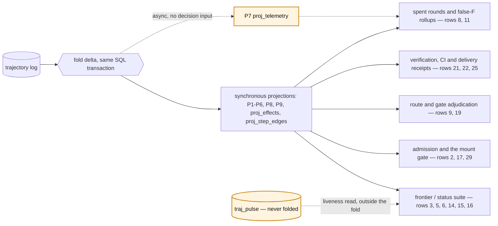

| # | Served by | Key fields / notes |
|---|---|---|
| 1 | P1+P2+P4 (+P6) | P1 carries pgid/pid/attempt_id and work_terminal_reason; results from P2.result; open gates P4; deep process detail P6. |
| 2 | P3+P1 (approvals from bd) | disposition from levels; per-clause refusal levels in proj_admission_clause, cleared per-clause by `admission.restored` — written by the authority's tick (§5), so clauses with no store event (cap, cooldown, defer-expiry) clear on the tick, not never; `#rN`/`#void` regex retires; attempt budget = P3 counters with the cap-release reset rule stated in the DDL. |
| 3 | P1+P2+P4+P5+P6 | cursor = P2 rows for (session, round); supersedes chain = `superseded_by_step_round` ordered by step_round; staleFences = P6. |
| 4 | P1 | pure rule over head columns; `outcome` and `held` separate axes. |
| 5 | P1+P2 aggregate | liveness reads `traj_pulse`; post-restore state is `unknown` and the wedge renders it — and the DETECTOR honours it (§2 F1). |
| 6 | P1+P3 aggregates | perSubstation on the `seat` column — populated by the service for every work-bead-bearing record, CHECK-backed (minor fix); sync stats stay stream. |
| 7 | P1+P2 | non-terminal sessions + cursor. |
| 8 | P1+P2+P4+P5 | first-class (bead, session, round) tuple; spent rounds read P5's **chain** (all step_rounds — the fatal-3 fix is what makes this row honest). |
| 9 | P4+P4-cycles+P5 | regate age from proj_gate (opened_at/regated_at/regate_count — real columns now); per-cycle history in proj_gate_cycles; adjudication reads the record. |
| 10 | P1+P2+P6 | lease sweep candidates from P6; teardown-replay arm retires; liveness `unknown` until next beat after restore. |
| 11 | P5+P7 | rollups over the **chain** (false-F needs superseded grades — preserved by the step_round key); timing triple complete. |
| 12 | service's own fold reads | in-transaction ⇒ strictly read-your-writes, no window. |
| 13 | P6 | adopt fence = live lease row keyed by attempt_id; liveness qualifier honestly `unknown` after restore. |
| 14 | P2 | eligibility scan on ix_state; incarnation a column. |
| 15 | P2+P5+proj_step_edges | blocks/validates edges flattened at pour; the chain half of the closure reads `superseded_by_step_round` on the cursor — written on EVERY step_round bump, supersede AND gate-cleared rearm (audit round 2), so the chain is unbroken at any depth across rearm boundaries (fatal 4 fix); no recursive CTE. |
| 16 | P2 (in-txn) | open molecule / open successor = cursor rows + MAX(step_round); duplicate mints die on idem_key with no batch window. |
| 17 | P3 + bd snapshot version | grant basis.snapshot_captured_at. |
| 18 | bd (links stay L) → P3 | unchanged. |
| 19 | P5 (synchronous) | sibling grades by (session, round, step_path, **latest step_round**, lane) with source_record_id; a superseded F is history, not overwritten — the route matrix reads current evidence and only current evidence. |
| 20 | P5 | freshness = round/step_round/seq stamps; round-fence file reads retire. |
| 21 | P5 | rc bound to head_sha_at_exec; verdicts with live SHA + drift flag; CI conclusions land at the PINNED step_round under lane `ci:<check_name>` (§2 F3 placement rule, audit round 2) — never re-derived from current state. |
| 22 | P5 | receipts aggregate; non-step-scoped facts land at the key carried by the record they correlate to (§2 F3/F4 placement rules). |
| 23 | P5 (synchronous) | validation_rc, grades. |
| 24 | P1 | the banned `bd export` dependency dies. |
| 25 | P5+proj_effects | pr_url/pr_number/reused/auto_merge per effect; `receipt` join key; acks land at the intent's (session, round, step_path, step_round) (§2 F4 placement rule, audit round 2). |
| 26 | `trajectory` + `traj show` | one table, one query, typed payloads (the verb formats — dolt diff renders whole-row, probe T8); pre-cutover eras stay dolt archaeology (red-team hold), said out loud. |
| 27 | stays live streams | per the contract's own marking. |
| 28 | log read API | `replay(fromCursor)` = `WHERE seq > ?` + codec decode. |
| 29 | P1 aggregate | COUNT(*) open; a consumed grant clears `open_grant_id` via the envelope `grant_id` join — no phantom slots (minor fix). |
| 30 | stays lock file (+ traj_epoch history) | ⚠loud: the losing booter's refusal is not appendable (held). |
| 31 | **proj_leases** (P9) | owner-side lease state has its OWN projection now (audit round 2): lease_id/lessee/kind/fencing_token/granted_seq/expires_at/state — P6 stays process identity, an owner lease never lands there; `fencing_token` a promoted, indexed envelope column (major fix); beats in traj_pulse (kind='lease'); per-wire-request fence validation is a proj_leases PK hit, not a trajectory scan. |
| 32 | deterministic fn + P6 | base_sha/cut-time/adopted on record — **plus the worktree-outstanding admission barrier** (§5), which is what actually prevents the stale adopt. |
| 33 | cursor file stays; dedupe+fence → P8 | rebuildable from `effect.command.received`; same-key/different-fingerprint is a detected, RECORDED conflict (`effect.command.refused`) — reachable now (major fix). |
| 34 | stays bd | state-store types vanish from it. |
| 35 | retired (Q14) | a landing-ready view over P5 CI rows is definable if a reader materializes. |

**Restart-lossy latches** (falsifier note): `_mountedIds` → P3 open grants;
`_mountEligibilityRefusals`/`_heldReported`/`_trustRefusedReported` → P3 clause levels (refusal
records + per-clause restores; flare dedup = idem-key uniqueness); mint & successor counters →
P3/P2; command map + fence → P8; `_gateSweepsScheduled` → the external-state obligation queries;
`_rearming` → P2 state machine. **None stay ephemeral.**

---

# 7 Session head summary (Q7)

The session bead survives as a human-readable index card in `bd list -t session`:

| Field | Source |
|---|---|
| `status` + `closed_at` | mirrors P1 |
| `grid.head.work_bead` | **immutable** — set at mint, never re-keyed |
| `grid.head.round` | current rework round |
| `grid.head.outcome` | terminal enum mirror, absent while live |
| `grid.head.held` + reason | human triage flag |
| `grid.session.model`, `rig`, `started_at` | mint-time constants |
| `grid.head.last_seq` | pointer into the trajectory |
| `grid.head.epoch` | **the ledger-side fence** (§5): the writing authority's epoch; a lower-epoch writer's stamp is refused |

Dropped: pgid/pid/token, `grid.result.*` copies, escalation/void/decline merges, operator-ruling
merges (retirement items 9–13). **Writer rule:** the fenced service is the sole writer — now with a
mechanism, not just intent: every head write is epoch-stamped, epoch-compared, and read back (§5).
Hand-edits are made harmless, not prevented: no fold, admission, or lifecycle read consumes the
head (they read P1); divergence is a standing obligation query keyed on bd's state, repaired on the
tick. The `tranquility-8krit` class dissolves twice over.

---

# 8 Open-question answers (headline eight; all nineteen in §11)

**Q2 — gate transitions.** Records are trajectory (family 5); the gate bead stays bd, stamped once
at mint with `attempt_id` + opening `record_id`, keeps `blocks=<sessionId>`, and gets a courtesy
reason refresh per cycle — epoch-stamped and read back like every service bd write. `close_cause`
is required on the close record; the bd half is a tracked obligation (`ledger_ack_seq`) with its
own retry.

**Q6 — flare vocabulary + null sink.** Flare names adopted near-verbatim as `record_type` values
plus the envelope they lack. The null sink is fixed by inversion: the append is the authoritative
act; the flare is derived from the committed record (emit-after-commit).

**Q8 — explicit unknown.** One `unknown` value on the shared promoted `outcome` column, required
open-vocabulary `unknown_reason`, `resolves_record_id` settlement chains — **now including attempt
terminals** (the guard permits settling, §4), not only effect acks.

**Q9 — effect intent granularity.** Per outward effect, keyed to the **logical mutation**
(`effect_id`, §1) — intent/ack pairs for commit, push, pr_open, automerge, direct_merge,
ci_rework_command. Crash-mid-delivery is a precise queryable wound with a named settler and a
respawn-proof key.

**Q10 — digest capture points.** Four, all captured while git state is live: (1)
`verify.scope.pinned`; (2) `verify.gating.rc` (wrapper stamps HEAD at exec — named tg-zfek change);
(3) `verify.verdict.recorded` (live HEAD, drift-compared against the pin); (4) delivery acks +
`verify.ci.concluded`. One indexed join key: `commit_sha`.

**Q15 — fencing token source.** `traj_epoch` (per-station history) + **`traj_fence` (the
enforcement)**: the epoch claim is an atomic INSERT under the station lock's exclusive-create; the
fence is the T6i counter-CAS — a single per-station cell both the appender and the advancer write,
with two fenced-out signals (§5 step 1's asymmetry): a 0-row CAS match (the post-steal steady
state) and error 1213 at COMMIT (the contended interleavings). **Measured enforceable on dolt 2.2.2** (probe T6i,
both interleavings). `uq_epoch_seq` (1105) and the non-decreasing-epoch alarm are the belt. Token =
`(epoch << 32) | counter`. Not the lock file (no epoch, stolen without record — tg-o2fy), not an
in-memory counter (restart amnesia), and not `FOR UPDATE` (measured dead — parsed, silently
ignored).

**Q17 — DurableStationEventLog.** Discard the implementation, adopt the read contract; tg-zfek
deletes the class, lifts the interface, keeps its tests as the reader's seed.

**Q18 — backfill markers.** `provenance ∈ {observed, inferred, reconstructed}` + basis.
`reconstructed` writable only by the migration-import path inside the transition service
(`source='migration_import'`) — never a separate fence-holding authority (red-team hold: right for
the reason given). Reconstructed facts are non-authoritative for admission and ordered by
`occurred_at`.

---

# 9 Migration posture

**Coexistence rule (fatal 5 — the drains-through-a-deleted-discipline contradiction is resolved by
quiescing):** the cutover unit is a named **record-type group** — a coherent write path that cuts
whole, never per-field, never dual-written — except the bounded shadow-compare window that begins
every stage. The groups: **G1** attempt lifecycle + `step.transition` (Stage 1), **G2** the graph
shape — `molecule.poured` + `step.superseded` (Stage 2), **G3** admission/grants (Stage 3), **G4**
verification + effects (Stage 4). G1/G3/G4 coincide with families; family 5 deliberately splits
into G1's transition stream and G2's graph shape — the step-churn path is the largest measurable
win behind the narrowest seam, and it cuts while the pour still mints beads (cert round: the
earlier "family" phrasing contradicted the Stage 1/2 split this document itself orders). **An epoch advance
that begins a stage is a QUIESCED boundary: it requires ZERO open sessions on the outgoing
discipline, enforced at boot** — the new epoch's boot refuses (loudly, exit-64-style) until the
legacy read shows zero open sessions; the boot-epoch boundary makes this checkable, and the stage
stamp rides `authority.epoch.advanced`'s basis. No in-flight session ever needs a terminal writer
that no longer exists, because no in-flight session crosses a stage. **Fallback, pre-stated:** if
quiescing proves operationally impossible (sessions that legitimately span days), the legacy
terminal path survives exactly one stage past its writers' retirement as a **read-only drain arm** —
terminal-writes-only, no new mints, with a stated deletion stage (the next one) and a stated
maximum drain window (one round cycle); the same rule applies at Stage 2 for `reapMolecule` over
legacy-poured beads. Rollback per stage = boot the previous epoch's code; trajectory tables are
additive. **The drain VEHICLE at a blocked cut, made explicit (audit round 2 — the F5 residual):**
when the new epoch's boot refuses because sessions are open on the outgoing discipline, the
operator either **boots the previous epoch's code to drain** (the rollback line above, doing
double duty as the drain procedure — the outgoing discipline's writers run until its sessions
reach terminal) or **closes/harvests the open sessions directly** (the standing harvest-review /
close-session playbooks). There is no third path; a stage cut never proceeds over open sessions.

**Legacy reads: a code-level dual-read, not a view (major fix).** The draft's `v_session_legacy`
is retired — the legacy read shape is a Dart disposition rule (`session_disposition.dart:80-116`,
`projectSession`), not a row shape, and re-writing it in SQL would fork the one implementation in
the exact window where divergence is invisible. Instead: **one read interface — read P1; on miss,
fall through to the existing bead reader and its existing disposition rule.** The fallback is
counted; **the fallback count reaching zero is the drain signal and the cut criterion** — strictly
better than "one full round cycle". The dual-read deletes with the legacy reader. A view survives
only for the `#rN` string synthesis, which is genuinely a projection. (P1's `last_seq` and
`outcome` therefore never need synthetic legacy values — legacy rows are simply not in P1.)

**The shadow comparator is a deliverable, not a posture (major fix):**
* **Verb:** the runner's `traj shadow-diff`, run per round by the operator (and by the stage checklist —
  a stage cut without N clean runs on record cannot proceed).
* **Output:** a typed mismatch report keyed `(session, field, legacy_value, fold_value, seq)`.
* **Cut criterion:** zero unexplained mismatches over 3 consecutive rounds, with a named allow-list
  for the known non-atomic-crash class (a crash between the legacy write and the trajectory append
  permanently mismatches that session; the report classifies it, the operator adjudicates it once).
* **Action on mismatch:** the stage cut is blocked; the mismatch flares; the fold is presumed wrong
  until shown otherwise (the legacy path is the incumbent oracle during its own replacement).
* **Unshadowable facts, stated so the ratification gate is not overread:** attempt_id, commit
  digests, per-effect intent/ack ordering, provenance markers, and incarnation identity have no
  legacy counterpart and are not tested by the shadow — the window certifies the *shared* facts
  only. (Red-team hold, preserved: the shadow's second writer targets bd, never `trajectory`; the
  sole-appender invariant survives the window.)

**Cutover order:**

* **Stage 0 — substrate + measurements.** `CREATE DATABASE trajectory` beside the ledger database (§10);
  `dolt_ignore` registration first; `traj_epoch`/`traj_fence`/`trajectory`/guard/pulse/proj_meta
  **and all P1–P9 DDL** (§4); the codec package with fixtures; the fenced service with the T6i
  fence, the full error contract (1213 / 1105 / corruption-halt, §5), the session-variable ban,
  and branch pinning; the tick skeleton; the
  `traj show` and `traj shadow-diff` verbs; the shadow fold for attempt lifecycle. **Measured
  here** (imported from the storage call, §10): bd's tolerance of the sibling database; online gc
  semantics on the shared server; append latency under concurrent bd load with the full
  synchronous projection set; fence behavior across a server bounce mid-transaction; rebuild
  duration at ≥100 k rows; the two-database restore drill; the CI guard tests (status-clean after
  fold writes, force-ban, dolt_log commit counting, `--doltcfg-dir`, branch-change fail-closed,
  and the CHECK-refusal pin — a T2-style violating INSERT per constraint, all seven, covering
  the two post-probe additions ck_grant_link and ck_seat; cert round).
  Also: fix the cursor-file path doc discrepancy (Q19).
* **Stage 1 — tg-zfek's ratification gate: the terminal tail + step-state churn together, behind a
  quiesced boundary.** Mint, round-retire, terminal become single atomic appends (head as
  projection side-effect); step transitions ride the service; the tick goes live running **ONLY
  the attempt/step-family obligation queries** (audit round 2 — the coexistence rule applies to
  the tick's writers too: the authority's eligibility re-evaluation and its
  `admission.refused`/`admission.restored` records move to Stage 3 with their family, as do the
  grant obligations, which have no grants to read before then). **The Stage-1/2 worktree barrier
  is enforced by the LEGACY admission path instead:** a new eligibility clause in the existing
  mount-gate code reading P6 (`worktree-outstanding` — a flare-only refusal, like today's
  clauses); it becomes a trajectory-recorded refusal at Stage 3. This closes the barrier-timing
  gap: the barrier LOGIC arms here, its trajectory record arrives with its family. Teardown
  replay deletes here — falsifier clause 2's first checkpoint. The reap survives this stage (pour
  still mints beads).
* **Stage 2 — pour + successors**, quiesced boundary again. `molecule.poured` + `step.superseded`
  replace bead creates; step/molecule bead types stop existing; **then** `reapMolecule` deletes,
  with a one-shot legacy reap at first post-cut boot for the residue class. **Falsifier clause 1
  checkpoint:** the frontier/status suite (rows 3/5/6/14/15/16) runs from projections only.
* **Stage 3 — admission** (converging with tg-wu5a): grants with fences; mount-attempt beads
  retire; `_mountedIds` and the latch set retire; session beads slim (§7); the authority's
  eligibility re-evaluation and the admission-family tick queries go live; the
  worktree-outstanding barrier — armed as a legacy clause since Stage 1 — becomes a
  trajectory-recorded refusal.
* **Stage 4 — verification + effects:** digest capture (incl. the gating-wrapper stamp), per-effect
  intent/ack, deliver-then-claim flip, the CiFeedbackProjection arm wired through the service
  reading P1, `grid.result.*` merges retire behind P5.
* **Stage 5 (optional) — backfill: open sessions only**, `provenance='reconstructed'` via the
  in-service importer; `reap_backfill.sh`-class tooling deleted and the `traj_*`/`trajectory`
  namespace fenced off from operator hard-delete tooling. Whole-era import stays rejected;
  pre-cutover forensics stays dolt archaeology (row 26).

*The stage ladder with the record-type groups cutting whole at their stages. Each stage's contents
are the bullets above — only the group and the boundary are drawn here. The Stage 4 → 5 hop carries
no stated quiesced boundary, so none is drawn.*

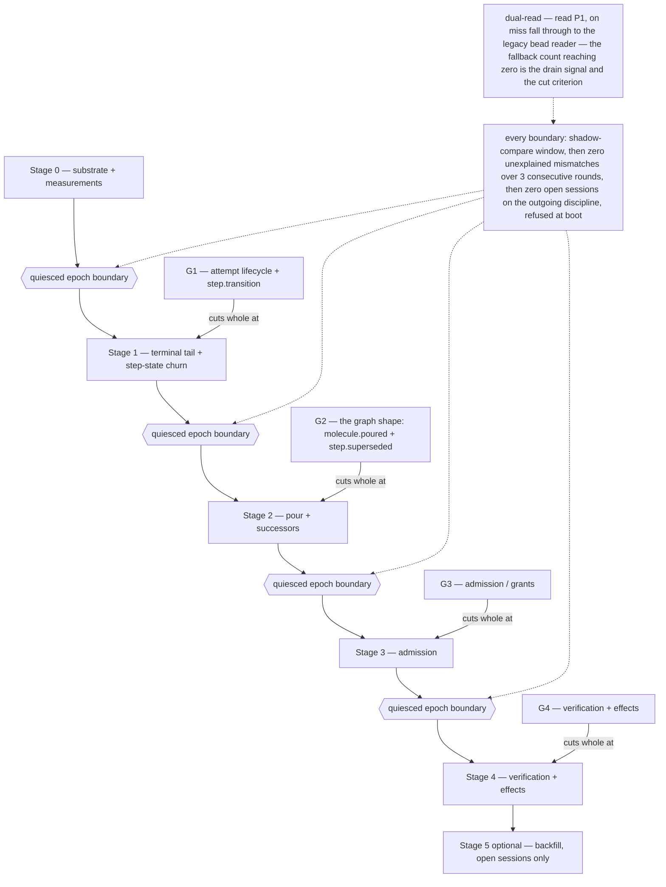

---

# 10 Storage: the separate-database shape

**The call (03-storage-call.md, imported; supersedes the decision's same-db default pending
operator ratification): a separate `trajectory` database, sibling of the ledger database, under the same
bd-owned dolt sql-server data dir (`.grid/.beads/dolt/trajectory/`, beside
`.grid/.beads/dolt/<state-db>/`).** The fenced transition
service connects to the same server bd proxies through, `USE trajectory`, and never touches
the ledger database over SQL. A fully separate store (own server process) is rejected. Everything in
§4–§5 carries over verbatim — nothing in the design depended on cohabiting bd's database, and the
probe ran on exactly this engine.

**Why (the call's arithmetic, in brief).** Same-db did not fail on write mechanics — T4 proved
selective staging holds its own commit cadence indefinitely at ~4% overhead without ever capturing
bd's dirty rows. It is overturned by growth arithmetic: ~14.6 KB of *unreclaimable* history per
dolt commit (T7b) × the ~2,880/day cadence floor ≈ 15 GB/year of permanent monotonic history
landing inside bd's clone/pull/backup domain — the 18 GB pathology reincarnated inside the work
ledger. Plus: the attribution cost is unfixable from the grid's side (whether bd ever issues
`-a`-shaped commits is bd-internal, version-dependent), and at the cadence floor the shared log
would be >99% trajectory commits, drowning the operator's commit-attribution forensics (the
practice that produced the 81%-churn diagnosis this decision rests on). The one-backup-domain
benefit is thinner than assumed: the operational boundary is the server data dir, and `proj_*` /
`traj_pulse` punch through any single-domain purity in either shape.

**The operational contract:**

* **Server lifecycle.** One server, bd-owned, config unchanged; `trajectory` created once via SQL.
  **Stop order:** quiesce the transition service first (it goes inert; §5 fenced-out behavior),
  then bd proxy cleanup per the standing playbook, then the server. **Start order:** server, bd,
  service — the service's first act on any (re)connect is the fence recheck; a refused append
  during a bounce is a loud fence failure, never a hang. `reload` never applies to the service
  (snapshot-resident rule); bounce to pick up code.
* **gc is MANDATORY, SCHEDULED work — not hygiene** (probe T8: the uncommitted transaction journal
  grows ~22–24 KB per append regardless of payload size — ~1 MB/s at measured storm tempo; ~99%
  gc-reclaimable). `CALL DOLT_GC()` targets the `trajectory` database on a cadence set by stage-0
  measurement 2 — steady interval if online gc proves non-disruptive to bd on the shared server,
  service-quiesced windows if not. The ledger database's gc cadence is untouched; trajectory workload
  adds zero journal to bd's files. CLI gc runs inside `dolt/trajectory/` with `--doltcfg-dir`
  discipline.
* **Backup.** One snapshot procedure over `.beads/dolt/` (quiesced), or two `dolt backup` remotes —
  both databases always as a pair, timestamped together. Restore = both to the paired time, then
  mandatory fold rebuild, liveness `unknown` until next beat, head re-stamp repair pass for
  `grid.head.last_seq` pointers that outrun a restored trajectory (the only cross-database
  consistency seam this shape has; there is no transactional coupling to break). **The fence cell
  is NOT in the backup and needs no restore** (audit round 2): `traj_fence` is dolt_ignore'd
  working-set state, reinitialized from `MAX(traj_epoch.epoch) << 32` on every (re)connect (§5) —
  a restore bringing back no cell, or a stale one, is harmless by construction. **Liveness reads
  `unknown` on more paths than restore** (probe T3 implication 3): restore/rebuild, epoch advance,
  a branch switch (each branch has its own working set — the ignored tables vanish), and the
  `--force` trap-recovery procedure all sweep `traj_pulse`; every one of them lands in the same
  detector-honoured `unknown`, never a minted `lost`.
* **Commit policy.** §5's cadence (30 s / 512 rows / boundary events / **hard 10 s minimum
  interval**), staging `trajectory`, `traj_epoch`, `traj_terminal_guard` by name. Growth relief:
  epoch-ranged archive tables become a **third sibling database on the same server** when
  triggered.
* **bd coexistence.** bd never connects to `trajectory`; the service never writes the ledger database
  over SQL — every bd-side effect rides bd's own surface as an epoch-stamped, read-back
  derived-obligation repair (§5). `dolt add --force` banned in all grid tooling. One grid per
  machine stands. The service holds persistent connections with the `@@dolt_force_transaction_commit`
  ban and both error handlers (1213 / 1105) wired distinctly.

**Payload policy** (corrected per probe T8): dolt stores and accounts JSON per cell but **renders
diffs whole-row** — a 16 KB rationale prints ~32 KB inside one wide table row, so `traj show` does
its own typed formatting (§4). The ≤16 KB rationale bound and digest-references-for-diffs stand,
now for legibility rather than storage. The size premise inverts: per-append overhead dominates and
few-large beats many-small (1.15× vs 2.25× amplification) — the storage levers are **append count
and commit count**, which strengthens coalescing heartbeats out of the log and `molecule.poured`
replacing the ~6k-bead pour.

**What stage 0 must still measure** (the probe ran solo on throwaway databases): (1) bd's actual
commit behavior and its tolerance of `CREATE DATABASE trajectory` under its data dir; (2) online gc
semantics on a shared multi-db server (does gc on `trajectory` kill connections serving
the ledger database; does bd's proxy auto-recover); (3) append latency under concurrent bd load with the
full synchronous projection set, against §5's ~22–28 appends/s need; (4) fence behavior across a
server bounce mid-transaction; (5) rebuild duration at ≥100 k rows; (6) the two-database restore
drill end-to-end; (7) the CI guard tests (§9 Stage 0).

**Flip conditions.** *Back to same-db* (all three required): stage 0 finds bd's stack cannot
tolerate the sibling database; **and** bd's commit style is verified never `-a`-shaped, pinned by a
test, re-checked per bd upgrade; **and** a real requirement materializes for trajectory to ride
the ledger database's exact remote/sync stream atomically. *Forward to a separate store (own server)*:
online gc measurably disrupts bd with no acceptable scheduling window; **or** the tg-y4fd soak
shows shared-server process contention degrading append latency below the full-projection-set
need; **or** federation requires trajectory served under its own auth/remote lifecycle. *Reopen the
whole storage shape:* a second appender ever exists (§12, unchanged).

---

# 11 Resolved questions

All nineteen from the inventory (changes from the draft marked):

1. **Attempt granularity.** Attempt = one process incarnation, four first-class parent scopes, two
   round ladders as separate columns (§3). **Amended:** a respawn ENDS the attempt
   (`exit_kind='respawned'` terminal shape); successor at `incarnation+1` with
   `predecessor_attempt_id`.
2. **Gate transition records.** Open/regate/close are trajectory records; the gate bead stays bd
   with the courtesy refresh — now epoch-stamped and read back, with `ledger_ack_seq` tracking and
   both-direction obligation queries (§5).
3. **Operator-ruling home.** A ledger act with a companion `verify.route.verdict(transport='operator')`
   appended first; the record authoritative on disagreement; dead `gate resolve` path deleted.
4. **`work.held`.** Dropped as a record; hold is durable level state in P1.
5. **Note-append sink.** Split by destination declared at the call site; `attempt.note` carries a
   service-minted `note_ordinal` (at-most-once accepted).
6. **Flare vocabulary + null sink.** Adopted near-verbatim; append first, flare derived
   post-commit.
7. **Head-summary contents.** Eight fields now (adds `grid.head.epoch`, the ledger-side fence);
   sole-writer is a mechanism (epoch compare + read-back), not an intent (§7).
8. **Explicit unknown.** One `unknown` outcome + open-vocabulary reason + settlement chains — now
   including attempt terminals via the settlement-aware guard (§4).
9. **Effect intent granularity.** Per outward effect, keyed to the logical mutation (respawn- and
   retry-proof); intent durable before the call by construction.
10. **Digest capture points.** Four, all live-captured, two mandated code changes (§8 Q10).
11. **On-disk critic artifacts.** Remain agent I/O; the service copies them into observer-written
    records; freshness is `round`/`step_round`/`seq`, never file mtimes.
12. **Fold ownership of in-memory state.** Every named latch becomes a projection (with DDL) or an
    external-state obligation query; nothing stays ephemeral by assertion.
13. **Reconciler claim ordering.** Deliver-then-claim; the dormant CheckConcluded arm is wired in
    stage 4 through the service, reading P1.
14. **`grid.landing_ready`.** Retired.
15. **Fencing token source.** `traj_epoch` (per-station) + `traj_fence` (the T6i counter-CAS —
    **measured enforceable**); token = `(epoch << 32) | counter`; 1213/1105 handlers; belt =
    `uq_epoch_seq` + the non-decreasing-epoch alarm (§8 Q15).
16. **Mount-attempt cap release.** The cap lives in P3 (with the reset rule in DDL:
    `cap_release_seq`); operator release = `admission.restored{clause:'attempt-cap', actor}`;
    the re-file protocol remains the human-side cure.
17. **DurableStationEventLog.** Discard implementation, adopt the read contract.
18. **Backfill markers.** Three-value provenance; `reconstructed` only via the in-service importer;
    non-authoritative for admission; ordered by `occurred_at`.
19. **Cursor-path trivia.** Fixed in stage 0.

---

# 12 Dissent log

Material disagreements, the choice made, and the strongest surviving argument for the road not
taken — updated where the probe or the red-team moved the ground:

* **Storage shape: typed satellites + CHECKs vs one JSON-payload log.** Chose the single table.
  **Surviving argument for satellites:** a database CHECK cannot be bypassed; a codec can. The
  mitigation (promoted CHECKed columns; sole appender) is now **empirically demonstrated** (probe
  T2: the five probe-era CHECKs refuse at write time; the two added since — `ck_grant_link`,
  `ck_seat` — are pinned by the stage-0 guard) — discipline plus constraints, still not the full
  lattice. If a second appender ever exists, revisit. (Unchanged in substance.)
* **Storage location: same database vs sibling database.** **NEW — decided by the storage call
  (§10), overturning the ratified default.** Surviving argument for same-db: T4 proved selective
  staging works, and one backup/sync domain is genuinely simpler. It lost to growth arithmetic
  (~15 GB/year of unreclaimable history inside bd's domain), unfixable attribution, and gc blast
  radius. The flip conditions in §10 keep the road open in both directions.
* **`idem_key` nullable vs NOT NULL.** Chose NOT NULL. The index-cost half of the dissent
  narrows: the key is now a fixed CHAR(64) hash, not a 160-char varchar, and the T7 numbers price
  the whole append at ~23 ms with the fence — the soak arbitrates. The authoring-burden half
  stands and is answered structurally: the grammar table is exhaustive, so a type without a key
  cannot ship.
* **Per-append transactions vs group commit.** Chose per-append. **Updated by probe T7:** the
  measured bottleneck is not the transaction — it is the **number of projection writes inside it**
  (~7.5 ms each; bare append 8.4 ms, full realistic ~24 ms). Group commit would help less than
  shrinking the synchronous projection set, so the pre-authorized retreat is re-ordered: async-fold
  candidates first (P4-cycles, telemetry columns), batching last, and only for provably
  re-observable records. The two guard rows (12/16) still forbid a batch window on their paths.
* **`admission.restored`: keep vs drop-as-derivable.** Kept — and the dissent's concession ("no
  evaluation runs when nothing attempts a mount") is now **answered rather than absorbed**: the
  evaluation runs on the authority's fenced tick (§5), so the record has a writer with an owner,
  an interval, and a clean-down contract. Surviving argument for dropping: if tg-wu5a makes
  admission continuously level-evaluated, the restored record becomes redundant and could retire.
  The red-team's alternative (time-bounded refusal levels with `expires_at` decay) was smaller but
  leaves staleness bounded-yet-real and gives the cap-release no auditable vehicle; rejected with
  thanks.
* **Heartbeat durability: ignored working-set table vs durable-but-prunable pulse history.** Chose
  the ignored table. Surviving argument for durable pulses: post-restore forensics ("was it beating
  before the crash?") are lost — the cost is now bounded by the detector's unknown-honouring
  contract (§2 F1), which removes the dangerous half of the loss.
* **Fence primitive.** **REWRITTEN — the probe settled it.** Chosen: station-lock exclusion +
  per-station epoch INSERT (history) + the **T6i counter-CAS** (enforcement), with `uq_epoch_seq`
  and the non-decreasing-epoch alarm as the belt. The draft's `FOR UPDATE` upgrade path **closes as
  NOT AVAILABLE, measured dead**: dolt 2.2.2 parses `SELECT … FOR UPDATE` and does nothing —
  silently, in both row-targeting and aggregate forms (T6b) — the worst possible shape, so the idea
  must not be re-proposed. The counter-CAS delivers what the CAS dissent wanted (refusal, not
  detection) at ~7 ms/append, with one stated cost: the fence cell is a global serialization point
  per station — acceptable under the sole-appender premise, fatal if a second appender ever exists
  (the same revisit condition as the storage shape).
* **Operator ruling: ledger act + companion record vs first-class trajectory record.** Unchanged;
  the surviving argument (grades belong in P5's rows; the split invents an ordering problem)
  stands, answered by the append-first ordering rule.
* **Backfill authority: distinct authority vs inside-the-service import.** Unchanged (red-team
  hold: right for the reason given). The residual cost — `authority_id` reads as the station for
  rows it never witnessed — stands logged; `source='migration_import'` + `provenance_basis` recover
  most of it.
* **Migration first client: terminal tail first vs step-churn first.** Both in one stage
  (tg-zfek), **now behind a quiesced boundary** (fatal 5), which removes the compounding-failure
  half of the churn-first argument: a stage that cannot start with in-flight sessions cannot strand
  them. The smallest-first-cut argument survives for the record.
* **Supersedes representation: edge rows vs a cursor column.** **NEW.** Chose
  `superseded_by_step_round` on `proj_step_cursor` (the chain is linear per path; an edge table
  needs from/to_step_round in its PK to avoid the collision fatal 4 found, and then models a list
  as a graph). Surviving argument for the edge shape: one uniform closure query over a single edge
  table; the cost is two queries (edges + chain) for row 15, accepted.
* **verdict/recovered: one type with transport vs two types.** **NEW (decided per the major
  defect).** Chose two record types. Surviving argument for one type: a smaller vocabulary and one
  P5 write path; it lost because the merged shape either blocks the recovered append (same idem
  key) or loses the recovered-not-authored distinction P5's per-lane key would flatten.

---

# 13 Falsifier status

**Contract coverage: all 35 rows are served or dispositioned exactly as the contract itself marks
them; none is unservable; no contract row needs to change.** The claims below are restated against
the V2 schema — the draft's version of this section made assertions (fully-specified P5, row 33's
fingerprint, epoch detection) that the red-team falsified; each is now true of the actual DDL.

* **Fold-served (29 rows):** 1–17, 19–26, 28, 29, 31, 32 — the enumeration is 29 rows
  (17+8+4), and 29+5+1=35; the headline previously said 28, an arithmetic slip carried from v1
  (audit round 2). Each row has named projection columns that
  exist in §4's DDL, including: row 2's per-clause refusal levels cleared by a restored record
  **with a live writer**; rows 8/11 reading P5's step_round **chain** and row 19 its latest; row
  9's regate age on real proj_gate/proj_gate_cycles columns; row 15's closure from
  blocks/validates edges + the cursor's chain column, written on every step_round bump
  (representable at any depth); row 31's owner-side lease state on **proj_leases** plus
  `fencing_token` as an indexed envelope column; row 33's same-key/different-fingerprint conflict
  as a reachable, recorded refusal.
* **Deliberately on their contracted substrate (5 rows):** 18 and 34 stay bd; 27 stays live
  streams; 30 stays the lock file (plus durable epoch history); 33's cursor half stays a file.
* **Retired with an explicit decision (1 row):** 35.
* **One loud sub-fact remains out of reach, by physics:** the losing booter's lock refusal (row 30)
  — held, unchanged, and now stated consistently everywhere (the §5 stale-fence self-append
  contradiction is deleted).
* **One degraded-mode caveat, stated to its consumers AND its detector:** rows 5/6/10's liveness is
  served from `traj_pulse`, deliberately non-rebuildable; after restore/rebuild, epoch advance, a
  branch switch, or the `--force` trap-recovery procedure (probe T3 implication 3 — audit round 2)
  it reads `unknown` until the next observed beat, the wedge renders that, **and the threshold
  detector honours it** — no lost-transition without a prior observed beat in the current epoch,
  so none of those paths can mint terminals for live attempts.

**Decision falsifier, both clauses.** Clause 1 (the fold serves today's frontier/status queries
from projections): the round-bearing two-ladder keys now run through P2 **and P5**, the closure has
both halves at any chain depth, per-append synchronous folds give rows 12/16 zero window, and the
stage-2 checkpoint runs the suite from projections only. Clause 2 (append-only retires the reap and
the stranded-board class): `attempt.terminal` is one record with no tail; the former tail members
are derived obligations **keyed on the external state they repair**, run by a defined, fenced,
owner-named tick with a clean-down fixpoint; the worktree barrier makes repair lateness fail-closed
instead of scar-shaped; `molecule.reaped`, the teardown replay, and `reap_backfill.sh` delete on a
quiesced stage order that structurally cannot strand a bead. The tg-y4fd soak receives a
measurement plan with **probe-anchored numbers**: fence enforceability measured (T6i — enforced),
append latency measured (~23 ms fenced+1-projection, ~42/s; full set ~22–28/s projected — measure
on the shared server), commit-cadence cost measured (4% / 48× storage at per-row), rebuild duration
to be measured at ≥100 k rows.

---

# 14 Revision log

Every red-team defect, by title, with what changed; then the probe and storage-call amendments.
No defect is rebutted — all 26 are accepted; three suggested fixes were replaced by a different
(operator-steered or probe-driven) mechanism, noted inline. Nothing on the holds list was weakened.

## Fatal

1. **Split-brain detector cannot detect the two-epoch case** → Adopted the probe's T6i counter-CAS
   as the PRIMARY fence (§4 `traj_fence`, §5 step 1): one per-station cell written by both the
   appender (monotonic low-bits increment) and the epoch-advancer; **error 1213 at COMMIT is the
   stale signal — never affected-rows** [SUPERSEDED by audit round 2, item 3: 0 rows is ALWAYS a fenced-out refusal; 1 row is never proof — §5 step 1's asymmetry] (T6d: the CAS predicate is snapshot-blind); `FOR UPDATE` is
   measured dead and said so. The suggested `UPDATE … SET last_seq=?` write-touch was upgraded to
   the counter-CAS because T6d/g measured that a different-column touch cell-merges silently and a
   same-value write is a no-op — only a guaranteed-different same-cell write conflicts. The
   defect's alarm predicate is also adopted verbatim: `boot_epoch` non-decreasing over `seq`,
   asserted per-append and full-scanned at boot (§1, §5). `uq_epoch_seq` (1105, distinct handler)
   stays as the belt; `@@dolt_force_transaction_commit` banned on every service connection.
2. **admission.restored has no writer / tg-y4fd tripwire** → The eligibility re-evaluation is
   homed in the `StationAdmissionAuthority` itself, riding the same fenced service tick as the
   derived obligations — owner, 30 s interval, fenced appends, run-to-fixpoint before
   `authority.epoch.closed` on a clean down, built in Stages 0–1 (§5, §2 F2, §9; audit round 2
   re-stages the eligibility re-evaluation itself to Stage 3 with its family — see below). The tripwire is
   addressed explicitly in §2 F2: re-running the authority's own pure mount-gate policy over
   versioned snapshots reconstructs no tree/session state — it is option B's ratified job. (The
   red-team's smaller option (ii), time-decaying refusal levels, is logged as rejected in §12.)
3. **proj_verification PK drops step_round** → PK is now
   `(session_id, round, step_path, step_round, lane)` with `attempt_id`/`incarnation` attribution
   columns (§4). Every §6 row naming P5 was re-audited: rows 8 and 11 read the chain, row 19 reads
   the latest step_round (§6). A superseded F is history, never overwritten; the fail-open route
   scenario is closed.
4. **proj_step_edges collides on the second supersede** → Supersession is no longer an edge:
   `superseded_by_step_round` on `proj_step_cursor` models the linear per-path chain;
   `proj_step_edges` carries blocks/validates only (§4). §3 restated unambiguously: successors keep
   the path and bump `step_round`. (The alternative — from/to_step_round in the edge PK — is logged
   as the road not taken in §12.)
5. **Legacy sessions drain through a deleted discipline** → Stage boundaries are QUIESCED: an epoch
   advance beginning a stage requires zero open sessions on the outgoing discipline, enforced at
   boot; the read-only drain arm (one stage, terminal-writes-only, stated deletion stage and
   window) is the pre-stated fallback if quiescing proves impossible (§9). The Stage-2 reap
   contradiction is covered by the same rule.

## Major

6. **Fenced-out service told to append its own refusal** → Clause deleted; §5's fenced-out contract
   now matches §2 F2's physics: loser emits stdout+flare and goes inert; the successor appends the
   steal record and settlements.
7. **idem_key VARCHAR(160) overflow** → `idem_key` is CHAR(64) SHA-256 over a canonical grammar
   string; `idem_key_text` VARCHAR(512) non-unique for greppability; stage-0 test pins the builder
   (§1, §5).
8. **effect_id ordinal undefined / respawn mints new ids** → effect_id keys the logical mutation:
   `<session>:<round>:<step_path>:<step_round>:<kind>:<target_digest>`; attempt_id demoted to
   attribution; probe-match rule stated (ambiguous probe settles nothing and flares) (§1, §2 F4).
9. **Refusal idem_key dedup-forever inverts the latch** → Level-shaped key
   `refused:<bead>:<clause>:<snapshot_rev>`; P3 clause level = latest refusal/restore pair by seq;
   grammar published (§2 F2, §5).
10. **Multi-clause beads latch stale clauses** → Per-clause refusals (first-refusal-wins dropped
    for the record stream, kept as a P3 presentation) and per-clause restores independent of
    overall eligibility (§2 F2).
11. **The "next service tick" undefined** → Defined in full: owner (the fenced service, a
    first-class seed), interval (30 s + post-terminal + boot), fenced, clean-down fixpoint before
    `.closed`, build stage (§5, §9).
12. **Deferred worktree reap re-arms the stale-adopt scar class** → The barrier fix:
    `admission.refused(clause='worktree-outstanding')` while P6 shows a live worktree under a
    terminal session for the bead — fail-closed, making repair lateness harmless (§5 obligations,
    §2 F1).
13. **Gate-close obligation keyed off the fold diverges permanently** → Every obligation query
    keys off the EXTERNAL state it repairs; both gate directions exist as standing queries;
    `proj_gate.ledger_ack_seq` tracks the read-back bd write with its own retry; N-failures policy
    stated (§4, §5).
14. **Service bd writes are a second, unfenced write path** → All service bd writes carry
    `grid.head.epoch`/`grid.gate.epoch` with monotonic refusal (higher-epoch bead wins) and are
    read back after every text write (§5, §7).
15. **~25 record types have no idem key; liveness/note/verdict un-keyable** → Full grammar table,
    one row per type, no exceptions (§5). Liveness keys on the observed crossing
    (`liveness:<attempt>:<beat µs>:<transition>`); notes get a service-minted ordinal
    (at-most-once accepted); verdict/recovered are two record types (decision logged in §12).
16. **traj_pulse is an admission input in practice** → The detector honours unknown: no
    lost-transition without a beat it observed within the current epoch; pulse truncated at epoch
    advance; PK renamed `subject_id VARCHAR(64)` (lease ids fit); prune rule on settled terminal
    (§2 F1, §4).
17. **Command idem_key makes fingerprint detection unreachable** → Key is
    `cmd:<wire-key>:<fingerprint>` — a different body is a DISTINCT record; P8 keys on the wire key
    alone and surfaces the conflict; `effect.command.refused(reason='fingerprint-mismatch')` is a
    new record type (§2 F4, §4).
18. **v_session_legacy cannot be a SQL view** → Replaced by the code-level dual-read behind one
    interface (P1, fall through to the one existing disposition rule); fallback count is the drain
    signal and cut criterion; a view survives only for `#rN` string synthesis (§9).
19. **Shadow compare has no owner, bar, or comparable surface** → Specified as a deliverable:
    `traj shadow-diff` verb, typed mismatch report `(session, field, legacy, fold, seq)`,
    cut criterion (zero unexplained over 3 rounds + crash-class allow-list), action on mismatch
    (cut blocked, fold presumed wrong), and the unshadowable-facts list stated (§9).
20. **35/35 claim breaks on four projections with no DDL** → P3 (proj_admission +
    proj_admission_clause), P4 (proj_gate), P4-cycles (proj_gate_cycles), P6
    (proj_process_identity), P7 (proj_telemetry) all have DDL (§4); `fencing_token` promoted to an
    indexed envelope column with ck_grant coverage; §13's per-row claims re-walked against the
    actual columns.
21. **traj_epoch globally keyed starves the second station** → PK `(station, epoch)`; fence
    `MAX(epoch) WHERE station=?`; `uq_epoch_seq` is `(station, boot_epoch, epoch_seq)`; per-station
    fence cell in `traj_fence` (§4).
22. **traj_terminal_guard makes an unknown terminal unsettleable** → The guard permits the
    settlement chain: unsettled terminals INSERT (two independent terminals still impossible);
    settling terminals (`resolves_record_id` set) UPDATE `seq` + `settled_by` (§4, §2 F1).

## Minor

23. **seat column nothing populates** → Derived at append by the service from the work bead's
    store prefix; envelope-construction rule in §2.6; `ck_seat` CHECK (§1, §4).
24. **grant_id vs grant_record_id duplication** → `grant_id` is the only join key, CHECKed present
    (`ck_grant_link`) on every grant-lifecycle record and `attempt.session.started`;
    `grant_record_id` payload fields deleted (§1, §2).
25. **Respawn contradicts one-incarnation attempts** → A respawn ENDS the attempt
    (`exit_kind='respawned'` terminal shape); successor at `incarnation+1` with
    `predecessor_attempt_id`; `respawn_epoch` dropped (§2 F1, §3).
26. **traj replay truncates live decision inputs** → Replay requires station-down OR
    shadow-rebuild-and-swap (RENAME in one transaction); readers refuse past a stated lag bound
    (512 records / 60 s) (§5 Rebuild).

## Probe amendments applied (03a-dolt-probe.json)

* **T1:** DDL ships verbatim (hedging dropped); `--doltcfg-dir` operational note (§5, §10).
* **T2:** CHECK enforcement stated as measured; ENUMs fail closed under strict mode (§2.6).
* **T3:** `dolt add --force` banned; the sprung-trap consequence (permanently dirty working set,
  `-Am` silently stops committing) named; **branch pinning is a hard service invariant** (in-server
  `DOLT_CHECKOUT` vanishes every projection); status-clean-after-fold-write is a CI guard (§5, §9).
* **T5:** seq is monotone NOT gapless — said explicitly; gaps are expected, only
  `(station, boot_epoch, epoch_seq)` is contiguous (§1).
* **T6a/b:** read-only fence invisible (measured); `FOR UPDATE` measured dead — §12's dissent entry
  closed as NOT AVAILABLE so the idea is not re-proposed.
* **T6c:** epoch-claim arbitration corrected — dolt's conflict detection (error 1213), not the PK;
  claim path handles 1213, never 1062 (§4 comment).
* **T6d/g/h/i:** the counter-CAS adopted as primary fence; affected-rows explicitly disqualified as
  a signal (over-applied — refined by audit round 2 below: 0 rows = fenced out, 1 row = not
  proof); ~7 ms/append cost stated; the global-serialization-point cost logged (§5, §12).
* **T6e/f:** the belt's honest scope stated (same-epoch_seq collisions only); the 1105-vs-1213
  distinction wired; `@@dolt_force_transaction_commit` banned (§5).
* **T7:** throughput numbers imported (~23 ms fenced append, ~42/s; full set ~22–28/s); the
  retreat re-scoped — projection-write count, not the transaction, is the lever (§5, §12);
  `dolt_log`-based commit counting mandated (the `--skip-empty` measurement trap).
* **T7b:** hard minimum interval (10 s) between dolt commits regardless of boundary events;
  commit-count-not-row-count framing (§5, §10).
* **T8:** §10 payload policy corrected — dolt renders JSON whole-row (`traj show` formats its own
  output); size premise inverted (few-large beats many-small; append/commit count are the levers);
  journal growth ~22–24 KB/append makes gc mandatory scheduled work (§4, §10).

## Storage-call amendments applied (03-storage-call.md)

* §10 rewritten entirely to the separate-sibling-database shape: the call, the justification, the
  operational contract (server stop/start order, mandatory scheduled gc, paired backup/restore
  drill, commit policy, bd coexistence), the stage-0 measurement list, and the flip conditions —
  imported, not re-derived.
* §10.4's growth relief valve becomes a third sibling database on the same server.
* §12 gains the same-db-vs-sibling dissent entry; the second-appender reopen condition unchanged.
* Stage 0 (§9) gains `CREATE DATABASE trajectory` and the call's seven measurements + CI guards.

## Self-found amendments (logged for honesty)

* **Fence/token bit-width:** the draft's `(epoch << 20) | counter` gives ~1M appends per epoch —
  ~7 h at measured storm tempo before the counter carries into the epoch bits. Widened to
  `(epoch << 32) | counter` (§1, §5).
* **`effect.ack` resolve ordinal:** `ack:<n>` with n from `proj_effects.resolve_count` is
  read-then-write and therefore not strictly deterministic under retry; accepted because the writer
  is the idempotent probe reconciler and a doubled resolve is harmless (the chain's latest wins) —
  stated in the grammar table rather than hidden.

## Steer decisions taken where the task left a choice

* **Supersedes representation:** `superseded_by_step_round` cursor column (not edge-PK extension) —
  rationale and the road not taken in §12.
* **verdict/recovered:** two record types (not transport-keyed one type) — rationale in §12.

## Audit round 2 (04a-audit.json — 8 partials + 12 new defects, operator-resolved)

Blocking fixes:

1. **traj_fence neither ignored nor staged** → added to `dolt_ignore` in STEP 0 as working-set
   state: the service reinitializes `fence_state` from `MAX(traj_epoch.epoch) << 32` on every
   (re)connect; the absolute counter carries no meaning beyond same-cell contention, so
   restore/rebuild losing it is harmless (§4 comment, §5 epoch claim, §10 Backup). The
   status-clean CI guard holds by construction.
2. **effect_id VARCHAR(191) overflow (the relocated truncation class)** → `effect_id` is CHAR(64)
   SHA-256 of the canonical effect string, with a non-unique `effect_id_text` on `proj_effects` —
   the same discipline `idem_key` adopted (§1, §4 both tables, §2 F4).
3. **Post-steal fence hole** → §5 step 1's signal contract rewritten to the ASYMMETRY the audit
   identified, superseding this log's item 1 ("never affected-rows"): **0 rows ALWAYS means
   fenced out** (the post-steal steady state — the snapshot carries the new epoch, no cell write,
   no conflict possible); **1 row is NEVER proof** (T6d) — proceed to COMMIT where 1213
   arbitrates. And the belt asserts gained a handler: non-decreasing-epoch violation or
   seq/epoch_seq disagreement is the **corruption-halt alarm class** — HALT, flare, operator
   (§5 error contract, §1 boot_epoch).
4. **Verification idem keys swallow supervised restarts** → `<incarnation>` added to the
   pin/gating/verdict/route grammars, matching `step.transition`; a restart's re-pin/re-rc/
   re-verdict appends, never dedupes (§5 grammar).

Staging and structure:

5. **Stage-1 admission half-cutover** → the Stage-1 tick runs ONLY attempt/step-family queries;
   eligibility re-evaluation and `admission.refused`/`.restored` move to Stage 3 with their
   family. The Stage-1/2 worktree barrier is a new eligibility clause in the LEGACY mount-gate
   path reading P6 (flare-only), trajectory-recorded from Stage 3 — which also closes the
   barrier-timing residual of major 12 (§5 tick, §9 Stages 1/3).
6. **Rearm holes the supersedes chain** → the chain rule generalized: EVERY step_round bump
   (step.superseded AND gate-cleared rearm) writes the predecessor's `superseded_by_step_round`,
   cause on the new row; the rearm keeps its bump (it kills the I-14 stale-join class)
   (§1, §2 F5, §4, §6 row 15).
7. **Row 31 lease state homeless** → `proj_leases` (P9): lease_id PK, lessee, kind,
   fencing_token, granted_seq, expires_at, state; P6 stays process identity (§4, §6 row 31, §13).
8. **"Federation-ready" contradiction** → per-station scoping restated as DEFENSIVE, read-side
   only; a second live appender remains the reopen-the-storage-shape trigger, and cross-station
   replay order is out of scope until that reopening (§1 station).

Smaller: **ghost `UNIQUE (work_bead_id, mount_ordinal)`** deleted from §3 (mount_attempt_id is a
per-evaluation ULID; uniqueness rides the id; proj_admission counts); **§13 headline** corrected
28→29 fold-served rows (29+5+1=35); **non-step-scoped placement rule** stated — CI conclusions
land at the PINNED step_round (lane `ci:<check_name>`), acks at their intent's key (§2 F3/F4,
§6 rows 21/22/25); **"all five CHECKs" → seven** in the three places it appeared, with
ck_grant_link/ck_seat named as post-probe and stage-0-pinned; **T3 liveness paths** (branch
switch, trap recovery) folded into §10's restore story and §13's caveat; **the drain vehicle**
at a blocked cut named in §9 (boot the previous epoch's code, or close/harvest the open
sessions).

## Certification round (operator-applied, 2026-08-31)

The scoped re-audit returned **minor-followups**: all 20 punch-list items verified in prose AND
DDL; ten regression-class items remained, each a sentence or a column. Applied directly by the
operator: **(1)** the cutover unit restated as named record-type groups G1–G4 (the "family" rule
contradicted the Stage 1/2 split it ordered); **(2)** `traj_fence` writes are UPSERTs and the
claim path seeds the row — a fresh home cannot brick on "0 rows = fenced out"; **(3)** the
reconnect reinit is epoch-guarded — a stale process goes inert without touching the live
authority's fence; **(4)** "cause on the new row" clarified to the trajectory record's payload
(P2 carries no cause column); **(5)** §3's ladder uniqueness enforced as `uq_incarnation` on
proj_process_identity; **(6)** the CHECK-refusal pin added to Stage 0's CI guard list;
**(7)** the 1105 handler branches on the violated constraint (`uq_idem` = designed dedupe,
`uq_epoch_seq` = detect-and-halt); **(8)** the CI placement rule gains its no-pin fallback
(bead-only correlation, receipt surface, never P5); **(9)** §2 F1's liveness-unknown list
aligned to the five paths; **(10)** the §14 fatal-1 entry marked superseded at its own site.

Stage-0 build amendments (operator-adjudicated review round, 2026-08-31): the §5 error contract
gains the measured statement-time 1062 paragraph — same-snapshot `uq_idem` duplicates die at
statement time as 1062 naming the value, arbitrated by idem-key probe (measured, stage-0 build).
Q19's cursor-file path discrepancy (`file_cursor_store.dart` doc comment vs the actual
`github_reconciler_binding_assets.dart` path) names files that live in the power_station repo,
not this one — its fix lands with the power_station side of the migration, cited here so the
Stage-0 checklist item does not read as skipped.

---

# 15 OTel `gen_ai.*` name alignment

Adopted from the landscape memo's I1/I2 (`docs/design/trajectory/landscape.md` §3). Everything in
this section is a **naming** decision. Nothing in it changes a contract, a column, or the append
path.

| OTel GenAI attribute | Where it lands here | Kind |
|---|---|---|
| `gen_ai.conversation.id` | ≈ envelope `session_id` (§1) | echo — the column keeps its own name |
| `gen_ai.agent.name` | ≈ `rig` on `attempt.session.started` (§2 F1) | echo — the payload key keeps its own name |
| `gen_ai.operation.name` | derived at export, never stored | derived — a function of `record_type` + `step_path` |
| `gen_ai.request.model` | `verify.usage.telemetry` v2 payload key | **adopted verbatim** |
| `gen_ai.usage.input_tokens` | `verify.usage.telemetry` v2 payload key | **adopted verbatim** |
| `gen_ai.usage.output_tokens` | `verify.usage.telemetry` v2 payload key | **adopted verbatim** |

Only the bottom three are real renames, and they cost one `type_version` bump under §2.6 rule 2
(v2 minted, the v1 decoder kept forever, the idem grammar untouched — §2 F3). The rest of that
record's payload — `cost_usd`, `premium_requests`, `num_turns`, `duration_ms` — has no `gen_ai.*`
counterpart and stays grid-local, verbatim.

**Rule 1 — envelope columns are NEVER renamed for OTel.** The promoted columns of §4 are this
store's identity: they carry the CHECK constraints, the unique keys, the fold joins, and the
bd-side correlation (`work_bead_id` / `session_id` / `step_path`). A `≈` in the table above is a
reader's aid for someone fluent in `gen_ai.*`, not a rename and not an alias column. `session_id`
is `session_id`. Renaming a promoted column to chase an external vocabulary would trade a
constraint the store enforces for a name someone else may change.

**Rule 2 — alignment is by NAMING only, never by contract.** Every `gen_ai.*` attribute, span,
metric, and event is stability level **"Development"** as of OTel v1.42.0 (2026-06-12) — none
Stable, no published stabilization timeline, and the namespace was just spun into its own repo for
a faster cadence (landscape.md §1). So: no dependency, no library, no conformance claim, and no
guarantee imported. Borrowing three key spellings binds nothing and can be re-spelled by another
`type_version` bump if OTel moves. The moment an OTel name would force a schema concession, a
nullability concession, or the sampling/truncation the GenAI spec explicitly permits, the answer
is no — the whole value of this store is guarantees, and a "Development" convention has none to
lend (landscape.md I6).

**Read side, designed and unbuilt.** The OTLP exporter seam (landscape.md I3) — a cursored,
restartable reader that turns committed rows into `invoke_agent` / `execute_tool`-shaped spans —
is **designed, not built**, and may never be built: Dart has no OTel SDK under OTel governance
(community#2718 is still open) and no `gen_ai` conventions at all. It is recorded here only to fix
the architectural rule while stating it is free: **export is strictly downstream**. An exporter
consumes committed rows by `seq` and may never enter the append transaction. An exporter that can
fail an append destroys the thing it was built to make legible.
